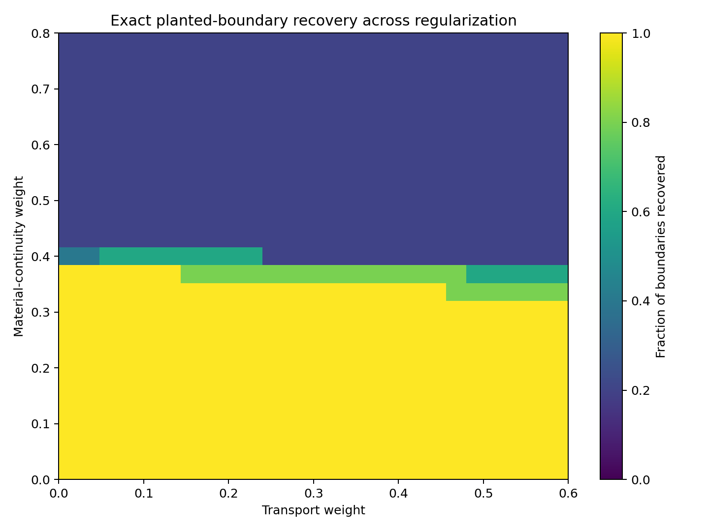
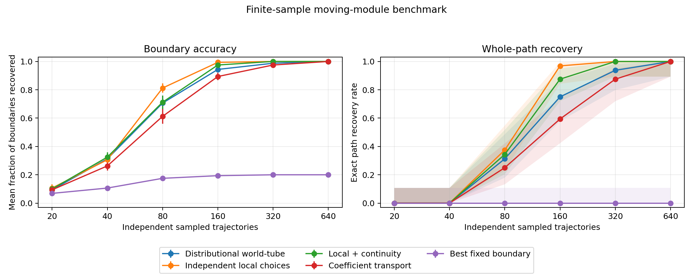
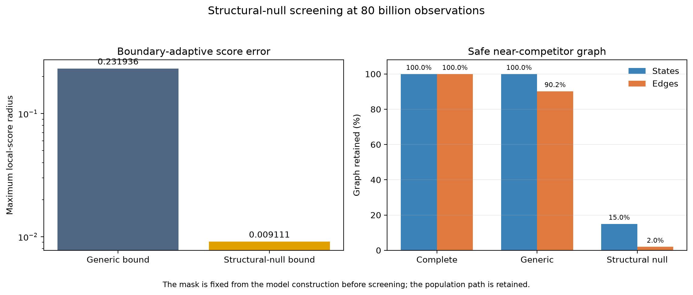
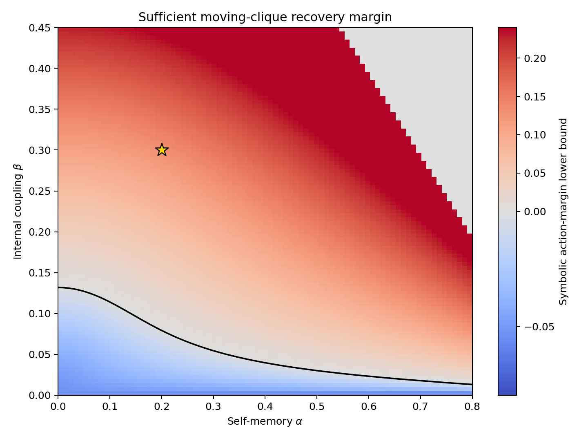
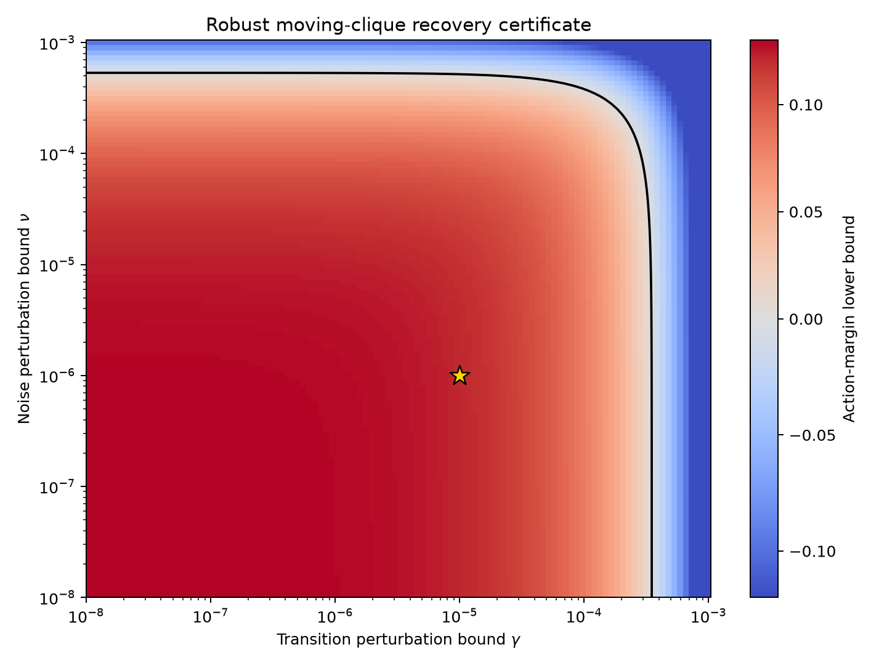

# Spatiotemporal Observer Mathematics

[](https://github.com/MahsaKeikha/spatiotemporal-observer-math/actions/workflows/test.yml)

An open research project by **Mahsa Keikha, PhD**.

**Start with the [complete research overview](docs/research_overview.md).** It
connects the central question, all 35 proved statements, all 20 reproducible
experiments, the code, and the current limitations on one page.

## The question

Most mathematical treatments begin by choosing a system and its environment.
That is often the right place to start, but it leaves a prior question
unanswered: what makes one boundary persist as the system changes?

Here the boundary is allowed to move. At time \(t\), a candidate observer is a
subset \(S_t\) of the available variables. Its history is the path

\[
\mathcal W=(S_0,S_1,\ldots,S_{T-1}).
\]

I call this path an **observer world-tube**. The name is operational. It means a
temporally linked sequence of subsystem boundaries, not a claim about subjective
experience.

The working question is:

> Can a changing boundary be inferred from internal dynamical integration,
> insulation from external drive, and transport of predictive structure?

## What is implemented

The present model is a time-varying linear Gaussian process,

\[
X_{t+1}=A_tX_t+\varepsilon_t,
\qquad \varepsilon_t\sim\mathcal N(0,Q_t).
\]

This setting is limited, but useful: the covariance evolves exactly, every
information quantity has a closed form, and failures cannot be blamed on a
neural estimator.

For each candidate boundary the code measures:

- cross-prediction across its weakest internal bipartition
- prediction imported from the present environment
- canonical-correlation persistence into the next state
- transport from one candidate boundary to another

A dynamic program then finds the globally maximizing path. A second dynamic
program finds the exact runner-up and reports the action margin. That margin
gives a deterministic radius within which bounded score perturbations cannot
change the selected path.

## Current numerical result

The first nonstationary test contains a planted three-variable module whose
membership shifts by one variable at every step:

```text
(0,1,2) -> (1,2,3) -> (2,3,4) -> (3,4,5) -> (4,5,6)
```

The optimizer recovers all five boundaries in this construction.

| Quantity | Value |
| --- | ---: |
| Recovered boundaries | 5 / 5 |
| Winning action | 1.254324 |
| Runner-up action | 1.127903 |
| Action margin | 0.126421 |
| Certified uniform score radius | 0.010535 |

This is a controlled calculation with known ground truth. It is not yet a
general recovery result. The phase diagram below is included because it shows
both success and failure: too much penalty on changing physical membership
forces the optimizer away from the moving process.



The fixed-boundary control is also intentionally simple. Correlated process
noise produces nonzero static integration, while the directed integration and
the combined score remain zero. This checks that correlation by itself is not
being mistaken for continuing internal organization.

### Recovery from estimated covariances

A second benchmark replaces analytical covariances with estimates from sampled
trajectories. Across 32 trials per sample size, exact world-tube recovery rises
from `0.313` at 80 trajectories to `0.750` at 160, `0.938` at 320, and `1.000`
at 640.



The comparison is not uniformly favorable to the full method. Independent
local selection performs better at intermediate sample sizes on this easy
construction. That negative result is recorded because it defines the next
test: a generative family in which local evidence is ambiguous and cross-time
transport is necessary.

The end-to-end 95% theorem is intentionally worst case. For the same population
margin it gives a sufficient sample count of approximately
\(1.263\times10^{19}\), compared with empirical recovery at hundreds of
trajectories. This gap is reported as a limitation and a target for sharper,
candidate-sensitive concentration bounds.

The rate calculation isolates the main cause: allowing a score factor to
approach zero changes the worst-case local-score rate from \(N^{-1/2}\) to
\(N^{-1/6}\), creating sixth-power dependence on the inverse action margin.

A localized certificate now uses candidate-specific covariance blocks,
positive score-factor floors, and an exact adversarial-path dynamic program.
On the same construction it lowers the sufficient sample count to approximately
\(3.132\times10^{12}\). This is a reduction by a factor of about four million,
but it remains far above the empirical scale and is reported as such.

The identifiability results also mark a hard boundary: paths are recoverable
only up to scientifically admissible symmetries, and observationally identical
models with incompatible boundary assignments cannot both be recovered with
probability above one half. This prevents an optimization result from being
mistaken for evidence that the underlying boundary is uniquely observable.

For a covariance-preserving moving-clique family, the score and recovery margin
now have closed forms in self-memory \(\alpha\), internal coupling \(\beta\),
module size, boundary overlap, and the action weights. In the committed example,
the symbolic margin lower bound is `0.130806`, the exact margin is `0.175335`,
and both select the planted moving path. A forward-backward screen reduces the
error-plausible graph at the localized threshold from 175 states and 4,900 edges
to the five planted states and four planted edges.

The closed-form result now has a finite-horizon perturbation extension. It
allows nonzero transition coupling across the planted boundary and anisotropic
process noise, propagates their spectral errors through the state covariance and
all three score factors, and gives a complete action-margin condition. With
transition and noise radii `1e-5` and `1e-6`, the committed construction has a
symbolic lower margin of `0.121550` and an exact margin of `0.175280`. Incorrect
candidates acquire small positive integration scores, so this check no longer
depends on exact zero-score degeneracy. A zero-cut partial-correlation argument
makes the incorrect-integration bound quadratic near the base model.

A second, parameter-level certificate compresses the covariance error to the
coordinates used by each candidate. It also charges the exact planted-edge
budget incident to each mismatched time. On the same deterministic example,
the maximum incorrect-score bound falls from `0.007891` to `0.001002`, and the
certified action margin rises from `0.121550` to `0.129801`. This calculation
enumerates all fixed-size candidates, so it is a sharper small-system
certificate rather than a replacement for the global-radius theorem.

An a priori support-aware certificate now obtains those local radii directly
from row-restricted transition perturbations and compressed covariance
forcing, without propagating the actual state covariance. It certifies an
action margin of `0.129669` on the same example, compared with `0.129801` for
the realized support-resolved calculation. It can evaluate a declared reduced
candidate family, with the explicit limitation that uniqueness then holds only
within that family.

The overlap-class certificate removes the perturbation matrices and individual
candidates from the final calculation. Given global radii and local budgets
indexed only by \(q=|C\cap S_t^*|\), it certifies all \(\binom ns\) candidates
using \(O(Ts^2)\) overlap-pair checks. On the same example it reduces ten
candidate cases to three classes, retains a positive action margin of
`0.127900`, and bounds every matrix-level candidate calculation. The example
uses enumeration only to audit the supplied budgets.

A direct alternative is implemented for two-type block-sparse perturbations.
Entry-magnitude and row/column-degree envelopes are converted into global and
overlap-local operator-norm budgets by a two-by-two comparison matrix. The
direct certificate does not store an \(n\times n\) perturbation or enumerate a
candidate. A 1,000-node example represents `8,250,291,250,200` five-node
candidates by six overlap classes and retains a certified margin of `0.045031`.

A block-local covariance recursion now preserves the location of perturbation
forcing across a fixed graph partition. In the committed eight-block line
example, a remote perturbation makes the global covariance radius positive at
the first step, while the local observer joint radius remains exactly zero
until the graph-distance-seven influence cone reaches it. This replaces a
global-norm artifact with a finite-horizon support statement.

The recursion also accepts a different partition at every time through
rectangular block comparisons. Split, merge, and reassignment are represented
as edges between adjacent partition layers, so no common refinement or
membership-history enumeration is needed. The committed example changes block
counts as `4 -> 3 -> 4 -> 2 -> 3` and retains an exact local zero until the
declared layered path reaches the observed block.

Those localized joint radii now propagate through the complete observer score
and world-tube objective. Candidate-specific integration, insulation,
persistence, local-score, and transport-score errors feed an adversarial
dynamic program. A positive robust slack certifies that every covariance
sequence inside the declared moving-partition envelope has the same unique
optimal path.

An exact class-compressed version removes explicit candidate block-union lists
when the population factors are symmetric within declared classes. It retains
one binary mismatch state so the adversarial dynamic program excludes the
planted path itself. The committed 1,000-node example evaluates six overlap
classes while representing more than eight trillion candidates per time and
an implicit five-step path count far beyond fixed-width integer ranges.

Exact within-class symmetry is no longer necessary. A further certificate
accepts componentwise lower and upper bounds for every local class and ordered
transport-class pair, expands them by separate covariance perturbation bounds,
and compares the planted lower action with the strongest competitor upper
action. The heterogeneous 1,000-node example retains a robust slack of
`0.449062` while using nonzero factor intervals and the same six-state dynamic
program.

The factor intervals can now be derived from representative covariance models
and certified within-class spectral residuals. A two-stage theorem separates
population heterogeneity from subsequent observation error and automatically
adjusts each member's eigenvalue envelope. In the committed large-family
example, this construction gives a robust slack of `0.530115` without supplying
factor widths by hand.

Those covariance residuals can also be derived rather than supplied. A moving
block comparison envelope is compressed onto each class's future blocks while
retaining the full present environment. This connects primitive transition,
forcing, and cross-error bounds to the residual, factor-interval, and path
layers. The structural example certifies a slack of `0.801508` over the same
candidate count.

A screened-environment extension permits smaller source-specific present
neighborhoods. It uses the conditional-information chain rule to charge every
omitted environmental contribution through an explicit leakage-tail bound. In
the committed example, the screened covariance radius is `2.500e-08`, compared
with `6.250e-05` for the full environment, while the robust slack remains
`0.799524`.

Independent sample splitting now closes the confidence-accounting loop for a
screen whose safety probability has been established. One split selects at
most a declared number of blocks; the other supplies fresh covariance estimates
for certification. The implementation reports both stagewise confidence levels,
their combined guarantee, and refuses certification when the same data are
reused.

The first-stage safety event is now derived for fixed Gaussian candidate blocks
rather than accepted only as an external assumption. Simultaneous covariance
concentration is propagated through the information and canonical-correlation
factors, then added to the independent certification budget before the
forward-backward screen is applied. This completes one explicit end-to-end
route from two data splits to a recovery confidence statement. The bound is
deliberately worst-case and its practical sharpness remains an open problem.

A positive-factor refinement now uses the empirical primitive factors whenever
their complete perturbation intervals remain above zero. In that regime, the
geometric score is locally Lipschitz and the screening radius can be much
smaller than the zero-safe Hölder radius. Entries near zero retain the original
fallback automatically. The comparison experiment reduces a complete
16-state/48-edge graph to the four states and three edges of the reference path
at a sample count where the zero-safe screen removes nothing.

The screening theorem now has a seeded Wishart calibration at five sample
scales spanning eight orders of magnitude. Across 64 trials at each count, the
covariance, primitive-factor, complete-score, and path-retention events were all
covered. The experiment also shows that coverage and usefulness are different:
the graph remains complete through 800 million observations and reaches the
five-state/four-edge population path only at eight trillion on this deliberately
strict worst-case calculation. The recorded Wilson interval prevents those 64
successes from being presented as a precise validation of a 97.5% tail claim.

The zero-factor bottleneck now has a boundary-adaptive treatment. When an exact
zero integration factor follows from structure fixed before the screening data
are observed, its conditional-information error is quadratic in covariance
error. Propagating that fact through the cube-root local score improves the
boundary rate from the generic \(N^{-1/6}\) to \(N^{-1/3}\). In the committed
calculation at 80 billion observations, the generic safe screen retains 40
states and 231 edges; the structural-null screen retains 6 states and 5 edges,
including the population path. A false null declaration invalidates the
guarantee, and a counterexample is included in the tests.

[](docs/reproducible_results.md#experiment-t-structural-null-boundary-screening)





## Read the project

| Document | Contents |
| --- | --- |
| [Research overview](docs/research_overview.md) | One-page map of the question, 35 propositions, 20 experiments, evidence, code, and limitations |
| [Reader guide](docs/reader_guide.md) | Recommended reading order, notation, theorem map, and interpretation |
| [Assumption ledger](docs/assumption_ledger.md) | Conditions required by each result and consequences of violation |
| [Mathematical framework](docs/mathematical_framework.md) | Definitions and the world-tube objective |
| [Space, time, and observer identity](docs/space_time_observer.md) | The conceptual bridge and the mathematics still missing |
| [Derivations](docs/derivations.md) | Gaussian information formulas, canonical transport, and dynamic programming |
| [Proved results and open problems](docs/proofs_and_conjectures.md) | Thirty-five proved statements and the remaining sharpness questions |
| [Experimental protocol](docs/experimental_protocol.md) | Exact model construction, parameters, controls, and known weaknesses |
| [Reproducible results](docs/reproducible_results.md) | Recorded outputs and validation commands |
| [Relation to existing work](docs/novelty_audit.md) | Scope comparison and conditions that would narrow the project |
| [API guide](docs/api.md) | Public functions and minimal examples |
| [Research program](docs/research_program.md) | Completed work and next tests |

The implementation lives in [`src/observer_math`](src/observer_math), the
experiments are in [`examples`](examples), and each mathematical invariant used
by the code has a corresponding test in [`tests`](tests).

## Reproduce the calculations

```bash
git clone https://github.com/MahsaKeikha/spatiotemporal-observer-math.git
cd spatiotemporal-observer-math
python -m venv .venv
source .venv/bin/activate
python -m pip install -e ".[dev,viz]"
python -m pytest
python -m ruff check .
python examples/baseline_experiment.py
python examples/worldtube_experiment.py
python examples/finite_sample_benchmark.py --trials 32 --jobs 6
python examples/identifiability_counterexample.py
python examples/symbolic_recovery_experiment.py
python examples/perturbed_symbolic_recovery_experiment.py
python examples/block_sparse_recovery_experiment.py
python examples/localized_influence_cone_experiment.py
python examples/moving_partition_influence_experiment.py
python examples/moving_partition_recovery_experiment.py
python examples/class_compressed_recovery_experiment.py
python examples/heterogeneous_class_recovery_experiment.py
python examples/residual_derived_class_recovery_experiment.py
python examples/structured_residual_class_recovery_experiment.py
python examples/screened_environment_recovery_experiment.py
python examples/sample_split_screening_experiment.py
python examples/gaussian_safe_screen_experiment.py
python examples/factor_aware_screen_experiment.py
python examples/gaussian_screen_calibration.py --trials 64 --jobs 6
python examples/structural_null_screen_experiment.py
```

The automated checks run on Python 3.10, 3.11, and 3.12.

## Interpretation boundary

The score is a tool for studying a sharply defined identification problem. A
high value does not establish consciousness, sentience, agency, intelligence,
or moral status. The current evidence consists of exact identities, unit tests,
and small synthetic examples. A preliminary finite-sample simulation and a
conservative analytical sampling bound are included; practically sharp bounds,
broader null families, external-method comparisons, and the quantum
construction remain open work.

## Primary reference

Max Tegmark, "Consciousness as a State of Matter," *Chaos, Solitons & Fractals*
76 (2015), 238-270. [arXiv:1401.1219](https://arxiv.org/abs/1401.1219),
[doi:10.1016/j.chaos.2015.03.014](https://doi.org/10.1016/j.chaos.2015.03.014).

## Status

This is an ongoing study, not a finished paper. Version 0.22.1 presents the
structural-null boundary theorem and safe-screen implementation through a
central visual overview. Every proposition, experiment, figure, command, and
limitation can be followed from that page to its detailed source. The repository
will change as higher-precision calibration, counterexamples, comparisons, and
sharper proofs are added.
