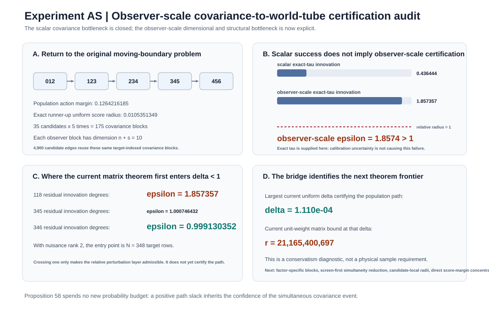
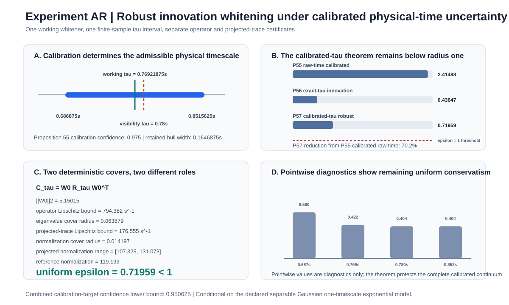

# Spatiotemporal Observer Mathematics

[](https://github.com/MahsaKeikha/spatiotemporal-observer-math/actions/workflows/test.yml)
[](CITATION.cff)
[](LICENSE)

**Mahsa Keikha, PhD**

> **If a subsystem is allowed to move through a larger physical system, when can its boundary be inferred from the dynamics rather than fixed in advance?**

This repository develops a mathematical and computational framework for **time-dependent subsystem identification**. The object of inference is not one static partition, but a moving path of candidate boundaries whose internal organization, environmental insulation, persistence, and transport are supported by the measured dynamics.

The primary conceptual starting point is Max Tegmark's observer-factorization question in ["Consciousness as a State of Matter"](https://doi.org/10.1016/j.chaos.2015.03.014). The mathematics developed here is an independent extension to time-dependent boundaries, finite-sample recovery, identifiability, physical-time calibration, and measurement certification. No endorsement by Tegmark is implied, and no theorem in this repository establishes consciousness.

## Start here

| Reader goal | Best entry point |
| --- | --- |
| Understand the entire project visually | **[Visual Research Guide](docs/visual_research_guide.md)** |
| Understand the physics, units, and model assumptions | **[Physics Guide](docs/physics_guide.md)** |
| See equations, physical meaning, and citations side by side | **[Physics + Mathematics + Citation Map](docs/physics_mathematics_citation_map.md)** |
| Read the scientific story in prose | [Research Overview](docs/research_overview.md) |
| Audit every theorem and experiment | [Research Index](docs/research_index.md) |
| Check assumptions and failure conditions | [Assumption Ledger](docs/assumption_ledger.md) |
| Trace every external source | [Bibliography and Citation Map](docs/bibliography.md) |
| Read machine-readable references | [`references.bib`](references.bib) |
| Understand the interpretation boundary | [Interpretation Protocol](docs/interpretation_protocol.md) |

---

# 1. Scientific thesis in one minute

Most analyses begin by choosing a subsystem boundary and then studying its dynamics. This project reverses part of that order.

At time \(t\), let the measured state be

\[
\boxed{
X_t=(X_t^{(1)},\ldots,X_t^{(n)}).
}
\]

A candidate subsystem is

\[
\boxed{
S_t\subseteq\{1,\ldots,n\},
}
\]

and its moving history is

\[
\boxed{
\mathcal W=(S_0,S_1,\ldots,S_{T-1}).
}
\]

The central question is whether the data support one such path more strongly than its alternatives after finite-sample uncertainty, temporal memory, nuisance structure, and identifiability limits are included.

The operational score uses four distinct dynamical ideas:

| Property | Physical question | Mathematical role |
| --- | --- | --- |
| **Integration** | Do internal parts add predictive information about one another? | directed conditional-information cut |
| **Insulation** | Does the measured exterior add comparatively limited next-step prediction? | conditional environmental leakage |
| **Persistence** | Does collective organization survive into the future? | canonical-correlation persistence |
| **Transport** | Can organization move into different measured coordinates? | cross-boundary predictive continuity |

The inferred world-tube is therefore a **dynamically supported moving subsystem**, not a fixed coordinate convention.

---

# 2. Physics first: observation model and fluctuation geometry

The main analytical observation model is

\[
\boxed{
X_{t+1}=A_tX_t+\varepsilon_t,
\qquad
\varepsilon_t\sim\mathcal N(0,Q_t),
\qquad
\varepsilon_t\perp X_t.
}
\]

Here \(A_t\) is an effective one-step coupling or propagation operator in the chosen measured coordinates, while \(Q_t\) represents unresolved stochastic forcing inside the declared model.

If

\[
\Sigma_t=\operatorname{Cov}(X_t),
\]

then

\[
\boxed{
\Sigma_{t+1}=A_t\Sigma_tA_t^{\mathsf T}+Q_t
}
\]

and

\[
\boxed{
\operatorname{Cov}(X_t,X_{t+1})=\Sigma_tA_t^{\mathsf T}.
}
\]

Therefore

\[
\boxed{
\operatorname{Cov}
\begin{pmatrix}
X_t\\X_{t+1}
\end{pmatrix}
=
\begin{pmatrix}
\Sigma_t & \Sigma_tA_t^{\mathsf T}\\
A_t\Sigma_t & A_t\Sigma_tA_t^{\mathsf T}+Q_t
\end{pmatrix}.
}
\]

This joint covariance is the fluctuation geometry from which the Gaussian information quantities are computed.

[](docs/physics_guide.md)

The model is an analytical approximation, not a claim that all physical systems are fundamentally linear, Gaussian, stationary, or separable. A physical application must validate its observables, units, sampling, nuisance structure, temporal law, and candidate geometry. See the [Physics Guide](docs/physics_guide.md).

---

# 3. Core mathematics and provenance

## 3.1 Gaussian information quantities

For Gaussian subvectors \(X\) and \(Y\),

\[
\boxed{
I(X;Y)
=
\frac{1}{2}\log_2
\frac{\det\Sigma_X\det\Sigma_Y}{\det\Sigma_{XY}}.
}
\]

For conditioning vector \(Z\),

\[
\boxed{
I(X;Y\mid Z)
=
\frac{1}{2}\log_2
\frac{\det\Sigma_{XZ}\det\Sigma_{YZ}}
{\det\Sigma_Z\det\Sigma_{XYZ}}.
}
\]

**Lineage:** [Shannon 1948](docs/bibliography.md#shannon-1948) and [Cover and Thomas 2006](docs/bibliography.md#cover-and-thomas-2006).

## 3.2 Integration

For a nontrivial bipartition \(S=U\sqcup V\),

\[
J_t(U,V)
=
I(X_U^{t+1};X_V^t\mid X_U^t)
+
I(X_V^{t+1};X_U^t\mid X_V^t),
\]

\[
\boxed{
\mathcal J_t(S)
=
\frac{1}{|S|}
\min_{U\sqcup V=S}J_t(U,V),
}
\]

\[
\boxed{
G_t(S)=1-2^{-\mathcal J_t(S)}.
}
\]

The broader conceptual lineage includes [Tegmark 2015](docs/bibliography.md#tegmark-2015), [Tegmark 2016](docs/bibliography.md#related-tegmark-work-tegmark-2016), and the integrated-information literature. The directed minimum-cut score above is a **repository definition**, not IIT Phi and not a Tegmark theorem.

## 3.3 Environmental insulation

Let \(\bar S\) denote measured coordinates outside \(S\). Define

\[
\boxed{
\mathcal L_t(S)
=
\frac{1}{|S|}
I(X_S^{t+1};X_{\bar S}^t\mid X_S^t),
}
\]

\[
\boxed{
K_t(S)=2^{-\mathcal L_t(S)}.
}
\]

This measures relative predictive closure, not thermodynamic isolation.

## 3.4 Persistence

For vectors \(X\) and \(Y\),

\[
C
=
\Sigma_X^{-1/2}
\operatorname{Cov}(X,Y)
\Sigma_Y^{-1/2}.
\]

Let \(\rho_i\) be the singular values of \(C\). Define

\[
\boxed{
P(X,Y)=\frac{1}{r}\sum_{i=1}^{r}\rho_i^2,
\qquad
r=\min(\dim X,\dim Y).
}
\]

**Lineage:** canonical correlation from [Hotelling 1936](docs/bibliography.md#hotelling-1936), with matrix-analysis tools from [Bhatia 1997](docs/bibliography.md#bhatia-1997).

## 3.5 Transport

For source \(S\) at time \(t\) and target \(R\) at time \(t+1\),

\[
P_t(S\to R)=P(X_S^t,X_R^{t+1}),
\]

\[
L_t(S\to R)
=
\frac{1}{|R|}
I(X_R^{t+1};X_{\bar S}^t\mid X_S^t),
\]

\[
\boxed{
\Theta_t(S\to R)
=
\sqrt{P_t(S\to R)2^{-L_t(S\to R)}}.
}
\]

This repository definition allows the organization to persist even when the measured coordinates representing it change.

## 3.6 Local score and world-tube objective

\[
\boxed{
\Omega_t(S)
=
\left[
G_t(S)K_t(S)P(X_S^t,X_S^{t+1})
\right]^{1/3}.
}
\]

For path \(p=(j_0,\ldots,j_{T-1})\),

\[
\boxed{
A(p)=
\sum_{t=0}^{T-1}\Omega_t(S^{(j_t)})
+
\chi\sum_{t=0}^{T-2}\Theta_t(S^{(j_t)}\to S^{(j_{t+1})})
-
\lambda\sum_{t=0}^{T-2}d_J(S^{(j_t)},S^{(j_{t+1})}).
}
\]

with

\[
\boxed{
d_J(S,R)
=
1-
\frac{|S\cap R|}{|S\cup R|}.
}
\]

**Lineage:** Jaccard geometry from [Jaccard 1901](docs/bibliography.md#jaccard-1901); exact finite-horizon optimization uses dynamic programming in the lineage of [Bellman 1952](docs/bibliography.md#bellman-1952). The complete world-tube objective is a repository definition.

The term `action margin` is an optimization margin. It is not physical action in joule-seconds.

## 3.7 Relative covariance certification

The central finite-sample event is

\[
\boxed{
\left\|
\Sigma^{-1/2}
(\widehat\Sigma-\Sigma)
\Sigma^{-1/2}
\right\|_2
\le\epsilon.
}
\]

When \(\epsilon<1\), inverse-covariance perturbation calculations remain in a controlled regime. The value one is a mathematical threshold, not a physical phase transition.

**Lineage:** [Wishart 1928](docs/bibliography.md#wishart-1928), [Tropp 2012](docs/bibliography.md#tropp-2012), and [Bhatia 1997](docs/bibliography.md#bhatia-1997).

## 3.8 Physical relaxation time and local innovations

The sampling-consistent temporal model is

\[
\boxed{
K_\tau(t_i,t_j)
=
\exp\left(-\frac{|t_i-t_j|}{\tau}\right).
}
\]

For irregular adjacent gaps,

\[
\alpha_i=e^{-(t_{i+1}-t_i)/\tau},
\]

and Proposition 53 gives

\[
\boxed{
X_{i+1}
=
\alpha_iX_i+
\sqrt{1-\alpha_i^2}\,\varepsilon_i,
}
\]

with exact local whitener

\[
\boxed{
W_\tau R_\tau W_\tau^{\mathsf T}=I,
\qquad
R_\tau^{-1}=W_\tau^{\mathsf T}W_\tau.
}
\]

**Physical lineage:** [Uhlenbeck and Ornstein 1930](docs/bibliography.md#uhlenbeck-and-ornstein-1930) and Gaussian Markov-process context from [Doob 1942](docs/bibliography.md#doob-1942). The irregular-grid formulas used by this project are proved directly in Proposition 53.

## 3.9 Equation provenance summary

| Object | Status | Main source or proof |
| --- | --- | --- |
| observer-factorization question | external conceptual starting point | [Tegmark 2015](docs/bibliography.md#tegmark-2015) |
| \(S_t\), \(\mathcal W\) | repository definitions | [Derivations](docs/derivations.md) |
| Gaussian MI and CMI | standard identities | [Shannon 1948](docs/bibliography.md#shannon-1948), [Cover and Thomas 2006](docs/bibliography.md#cover-and-thomas-2006) |
| integration and insulation scores | repository definitions | [Derivations](docs/derivations.md) |
| canonical persistence | standard CCA ingredient + repository averaging | [Hotelling 1936](docs/bibliography.md#hotelling-1936) |
| transport score | repository definition | [Derivations](docs/derivations.md) |
| Jaccard continuity | standard set geometry used by repository | [Jaccard 1901](docs/bibliography.md#jaccard-1901) |
| dynamic program | standard optimization method | [Bellman 1952](docs/bibliography.md#bellman-1952) |
| Gaussian covariance law | external foundation | [Wishart 1928](docs/bibliography.md#wishart-1928) |
| matrix concentration | external method specialized here | [Tropp 2012](docs/bibliography.md#tropp-2012) |
| e-value calibration | external statistical method specialized here | [Vovk and Wang 2021](docs/bibliography.md#vovk-and-wang-2021) |
| physical relaxation and innovation factorization | declared model + repository theorem | [P53](docs/proposition_53_physical_relaxation_time.md) |
| robust uncertain-\(\tau\) whitening | repository theorem | [P57](docs/proposition_57_robust_innovation_whitening.md) |
| covariance-to-world-tube bridge | repository theorem | [P58](docs/proposition_58_observer_bridge.md) |

For the detailed equation-level map, see **[Physics + Mathematics + Citation Map](docs/physics_mathematics_citation_map.md)**.

---

# 4. Current research record

| Research record | Current state |
| --- | ---: |
| Proved statements | **58 propositions** |
| Reproducible studies | **45 experiments, A-Z and AA-AS** |
| Scientific result figures | **33 figures** |
| Claim-level tests | **223 tests** |
| CI matrix | **Python 3.10, 3.11, 3.12** |
| Research-software version | **0.47.0** |

The explanatory physics pipeline is not included in the count of 33 scientific result figures.

---

# 5. Latest result: Proposition 58 / Experiment AS

[](docs/proposition_58_observer_bridge.md)

Proposition 58 returns the measurement-certification program to the original moving-boundary question.

For future candidate \(S\), define the observer covariance block

\[
\boxed{
B_{t,S}=(X_t,X_{t+1}^{S}).
}
\]

Its dimension is

\[
\boxed{
d_{\mathrm{obs}}=n+s.
}
\]

On the controlled benchmark,

\[
n=7,
\qquad
s=3,
\qquad
T=5,
\qquad
C={7\choose3}=35,
\]

so

\[
\boxed{
d_{\mathrm{obs}}=10,
\qquad
B_{\mathrm{obs}}=TC=175.
}
\]

The planted and recovered population path is

```text
(0,1,2) -> (1,2,3) -> (2,3,4) -> (3,4,5) -> (4,5,6)
```

with population optimization margin

\[
0.1264216185.
\]

The observer-scale diagnostic is deliberately negative. Even when the true relaxation time is supplied exactly, the current matrix theorem at 118 residual innovation degrees gives

\[
\boxed{
\varepsilon_{\mathrm{observer}}=1.8573569119>1.
}
\]

The current theorem first enters the relative perturbation regime at 346 residual innovation degrees:

\[
\varepsilon_{346}=0.9991303523<1.
\]

But crossing one is not enough to certify the complete world-tube. The current generic end-to-end factor-perturbation chain requires a much smaller covariance radius, approximately

\[
1.11\times10^{-4}.
\]

The corresponding large residual-degree calculation is a **conservatism diagnostic**, not a claimed physical sample requirement.

This identifies the current frontier: observer-scale dimension and structural worst-case propagation, not another calibration-only refinement.

[Full P58 proof](docs/proposition_58_observer_bridge.md) | [AS JSON](docs/observer_bridge_dimension_audit.json) | [AS experiment](examples/observer_bridge_dimension_audit.py) | [AS renderer](examples/render_observer_bridge_dimension_audit.py) | [tests](tests/test_observer_bridge.py)

---

# 6. Physical-time sequence: P53 to P58

The recent theorem sequence is one scientific argument. Each step answers a limitation exposed by the previous step.

| Result | Physical or statistical question | Controlled result |
| --- | --- | ---: |
| P53 / AM | Can temporal memory be parameterized in physical time? | sampling-consistent \(\tau\), exact irregular-grid Markov structure |
| P53B / AN | Can \(\tau\) be calibrated directly on irregular timestamps? | finite-sample continuum e-value confidence set |
| P54 / AO | Can calibration and target resolutions be separated? | target radius `3.15549 -> 2.57207` |
| P55 / AP | Can local likelihood curvature tighten the physical-time set? | retained hull width `0.1646875 s`; raw-time target radius `2.41488` |
| P56 / AQ | Can exact local innovations change the estimator? | exact-\(\tau\) scalar radius `2.16725 -> 0.43647` |
| **P57 / AR** | **Does the gain survive finite-sample \(\tau\) uncertainty?** | **uniform scalar radius `0.71959 < 1`** |
| P58 / AS | Can covariance uncertainty return to the full moving-boundary objective? | deterministic bridge; observer-scale current radius `1.85736 > 1` at 118 residual degrees |

## P57 trace-specific tightening

For one calibration-derived working whitener \(W_0\),

\[
C_\tau=W_0R_\tau W_0^{\mathsf T}.
\]

P57 uses an operator cover for the eigenvalue geometry and a separate trace-functional cover for the normalization

\[
\boxed{
d(\tau)=\operatorname{tr}(P_GC_\tau).
}
\]

Writing

\[
M=W_0^{\mathsf T}P_GW_0,
\]

we have

\[
d(\tau)=\operatorname{tr}(MR_\tau),
\]

and for exponential covariance entry

\[
R_\tau(i,j)=e^{-D_{ij}/\tau},
\]

\[
\frac{\partial R_\tau(i,j)}{\partial\tau}
=
\frac{D_{ij}}{\tau^2}e^{-D_{ij}/\tau}.
\]

This gives a direct deterministic Lipschitz bound on \(d(\tau)\), avoiding the much looser residual-rank-times-operator bound.

On Experiment AR:

\[
\boxed{
\varepsilon_{57}=0.7195879984<1,
}
\]

which is a **70.2% reduction** relative to the P55 calibrated raw-time theorem. The full derivation is in [Proposition 57](docs/proposition_57_robust_innovation_whitening.md).

---

# 7. Complete visual research atlas

Every scientific result figure is visible below and links to the documentation that explains what it measures, what assumptions it uses, and what it does not establish. For a curated figure-by-figure explanation, use the **[Visual Research Guide](docs/visual_research_guide.md)**.

## Phase I. Moving-boundary recovery

| Candidate scores and recovered path | Recovery landscape |
| --- | --- |
| [](docs/reproducible_results.md) | [](docs/reproducible_results.md) |

## Phase II. Finite-sample and perturbation recovery

| Finite-sample benchmark | Symbolic recovery region |
| --- | --- |
| [](docs/reproducible_results.md) | [](docs/reproducible_results.md) |

[](docs/reproducible_results.md)

## Phase III. Screening and localization

| Gaussian screen calibration | Structural-null screen |
| --- | --- |
| [](docs/reproducible_results.md) | [](docs/reproducible_results.md) |

| Trajectory-coupled screening | Relative covariance calibration |
| --- | --- |
| [](docs/reproducible_results.md) | [](docs/reproducible_results.md) |

## Phase IV. Cross-fitting, drift, and changing populations

| Cross-fitted calibration | Drift-robust calibration |
| --- | --- |
| [](docs/reproducible_results.md) | [](docs/reproducible_results.md) |

| Calibrated drift comparison | Multi-regime coupled calibration |
| --- | --- |
| [](docs/reproducible_results.md) | [](docs/reproducible_results.md) |

## Phase V. Temporally dependent measurements

| Dependent Gaussian calibration | Unknown-mean dependent calibration |
| --- | --- |
| [](docs/reproducible_results.md) | [](docs/reproducible_results.md) |

[](docs/reproducible_results.md)

## Phase VI. Time-varying nuisance structure

| Proposition 44 / Experiment AD | Proposition 45 / Experiment AE |
| --- | --- |
| [](docs/proposition_44_nuisance_projection.md) | [](docs/proposition_45_estimated_ar1_nuisance_projection.md) |

[](docs/proposition_46_design_specific_ar1_envelope.md)

## Phase VII. Direct matrix concentration

| Proposition 47 / Experiment AG | Proposition 48 / Experiment AH |
| --- | --- |
| [](docs/proposition_47_weighted_wishart_matrix_chernoff.md) | [](docs/proposition_48_uniform_matrix_chernoff_ar1.md) |

[](docs/proposition_49_compact_temporal_family.md)

## Phase VIII. Learning temporal physics from calibration data

| Proposition 50 / Experiment AJ | Proposition 51 / Experiment AK |
| --- | --- |
| [](docs/proposition_50_calibrated_temporal_family.md) | [](docs/proposition_51_evalue_temporal_confidence_set.md) |

[](docs/proposition_52_certified_evalue_outer_cover.md)

## Phase IX. Sampling consistency and physical-time calibration

| Sampling consistency | Irregular-grid Markov factorization |
| --- | --- |
| [](docs/proposition_53_physical_relaxation_time.md) | [](docs/proposition_53_physical_relaxation_time.md) |

[](docs/proposition_53b_irregular_tau_evalue.md)

[](docs/proposition_54_two_scale_irregular_tau_cover.md)

[](docs/proposition_55_quadratic_relaxation_calibration.md)

## Phase X. Exact local innovation target inference

[](docs/proposition_56_innovation_whitened_target.md)

## Phase XI. Robust innovation inference under calibrated physical time

[](docs/proposition_57_robust_innovation_whitening.md)

**Current tightened AR certificate:**

\[
\boxed{
\varepsilon_{57}=0.71959<1.
}
\]

## Phase XII. Covariance uncertainty back to world-tube recovery

[](docs/proposition_58_observer_bridge.md)

---

# 8. Theorem roadmap

| Layer | Propositions | Main role |
| --- | ---: | --- |
| A | 1-14 | foundations, transport, recovery, finite-sample stability, identifiability |
| B | 15-31 | structural compression, moving partitions, overlap classes, localized recovery |
| C | 32-40 | sample splitting, screening, adaptive calibration, population drift |
| D | 41-52 | dependent measurements, nuisance projection, matrix concentration, temporal-family calibration |
| E | 53A-53B | sampling-consistent physical relaxation and irregular-time finite-sample calibration |
| F | 54 | two-scale physical-time uncertainty propagation |
| G | 55 | local likelihood slope and curvature for sharper physical-time calibration |
| H | 56 | exact innovation-whitened target covariance concentration |
| I | 57 | uniform robust innovation whitening over calibrated physical-time uncertainty |
| J | 58 | relative covariance uncertainty propagated to observer world-tube recovery |

Detailed proof navigation:

- [Propositions 1-43](docs/proofs_and_conjectures.md)
- [P44](docs/proposition_44_nuisance_projection.md)
- [P45](docs/proposition_45_estimated_ar1_nuisance_projection.md)
- [P46](docs/proposition_46_design_specific_ar1_envelope.md)
- [P47](docs/proposition_47_weighted_wishart_matrix_chernoff.md)
- [P48](docs/proposition_48_uniform_matrix_chernoff_ar1.md)
- [P49](docs/proposition_49_compact_temporal_family.md)
- [P50](docs/proposition_50_calibrated_temporal_family.md)
- [P51](docs/proposition_51_evalue_temporal_confidence_set.md)
- [P52](docs/proposition_52_certified_evalue_outer_cover.md)
- [P53A](docs/proposition_53_physical_relaxation_time.md)
- [P53B](docs/proposition_53b_irregular_tau_evalue.md)
- [P54](docs/proposition_54_two_scale_irregular_tau_cover.md)
- [P55](docs/proposition_55_quadratic_relaxation_calibration.md)
- [P56](docs/proposition_56_innovation_whitened_target.md)
- [P57](docs/proposition_57_robust_innovation_whitening.md)
- [P58](docs/proposition_58_observer_bridge.md)

---

# 9. Reproducibility standard

A result is considered complete only when the relevant pieces exist together:

- physical question when a physical reading is intended;
- declared mathematical model;
- precise theorem or operational definition;
- assumptions stated near the claim;
- proof or derivation;
- implementation;
- claim-level tests;
- reproducible experiment when numerical comparison is useful;
- machine-readable result data;
- visible figure when visualization improves understanding;
- limitations and falsification conditions;
- correct links from the main page and research index.

For the current frontier:

| Result | Proof | Data | Experiment | Tests | Figure |
| --- | --- | --- | --- | --- | --- |
| P55 / AP | [proof](docs/proposition_55_quadratic_relaxation_calibration.md) | [JSON](docs/quadratic_relaxation_calibration.json) | [script](examples/quadratic_relaxation_calibration.py) | [tests](tests/test_relaxation_curvature.py) | [figure](docs/quadratic_relaxation_calibration.svg) |
| P56 / AQ | [proof](docs/proposition_56_innovation_whitened_target.md) | [JSON](docs/innovation_whitened_target.json) | [script](examples/innovation_whitened_target.py) | [tests](tests/test_innovation_whitening.py) | [figure](docs/innovation_whitened_target.svg) |
| P57 / AR | [proof](docs/proposition_57_robust_innovation_whitening.md) | [JSON](docs/robust_innovation_whitened_target.json) | [script](examples/robust_innovation_whitened_target.py) | [tests](tests/test_robust_innovation_whitening.py) | [figure](docs/robust_innovation_whitened_target.svg) |
| P58 / AS | [proof](docs/proposition_58_observer_bridge.md) | [JSON](docs/observer_bridge_dimension_audit.json) | [script](examples/observer_bridge_dimension_audit.py) | [tests](tests/test_observer_bridge.py) | [figure](docs/observer_bridge_dimension_audit.svg) |

```bash
python -m pip install -e ".[dev]"
pytest
ruff check .
```

---

# 10. What the repository establishes and does not establish

## Established under stated assumptions

The repository provides a conditional mathematical pipeline from measured stochastic dynamics to:

- time-dependent candidate subsystem scores;
- exact finite-horizon world-tube optimization;
- runner-up margins and robustness analysis;
- identifiability and observational-equivalence limits;
- finite-sample covariance certification;
- temporally dependent and nuisance-contaminated measurement models;
- finite-sample temporal-parameter calibration;
- physical relaxation-time representation;
- exact and robust innovation-whitened target inference;
- deterministic propagation of simultaneous covariance uncertainty back to the full world-tube objective.

## Not established

The repository does **not** establish:

- that every physical system has a unique subsystem boundary;
- that Gaussianity is universal;
- that one exponential relaxation time is universal;
- that covariance eigenvalues are physical energies without an additional derivation;
- that \(\epsilon<1\) by itself guarantees world-tube recovery;
- that the repository score is a measure of consciousness;
- that a recovered operational observer is conscious.

## Falsification and model checks

Relevant diagnostics include:

- residual temporal correlation inconsistent with the declared temporal family;
- multiple or drifting relaxation times;
- oscillatory or nonmonotone temporal dependence;
- heavy-tailed or non-Gaussian innovations;
- nonseparable space-time covariance;
- calibration-to-target mismatch;
- nuisance modes selected adaptively from the same target noise;
- candidate geometry inconsistent with physically admissible boundaries;
- inferred boundaries that fail under changes of sampling rate, units, sensors, or held-out data.

A theorem can be mathematically correct while its physical model is wrong for a particular experiment. Those are separate questions.

---

# 11. Current frontier

Proposition 58 changes the immediate research direction.

The dominant observer-scale bottleneck is now the combination of block dimension, simultaneous block count, and generic worst-case propagation through multiple score factors.

The next rigorous directions are:

1. **Factor-specific covariance blocks:** certify only the covariance geometry actually used by each information factor.
2. **Screen-first simultaneity reduction:** use safe screening and near-competitor structure so distant candidates do not consume the strongest simultaneous guarantee.
3. **Candidate-local uncertainty radii:** preserve heterogeneous uncertainty instead of replacing it by one global worst case.
4. **Direct score-margin concentration:** control score or action differences more directly rather than repeatedly passing through generic intermediate bounds.
5. **Richer temporal physics:** after the structural bottleneck is understood, extend beyond one stationary exponential timescale without losing finite-sample accountability.

The guiding question remains:

> **When does the dynamics itself justify a moving subsystem boundary, and when does the available evidence remain insufficient to identify one?**

---

# 12. Citations, bibliography, and attribution standard

The repository maintains three complementary citation layers:

| Citation layer | Purpose |
| --- | --- |
| [Bibliography and Citation Map](docs/bibliography.md) | full references plus the role each source plays |
| [`references.bib`](references.bib) | machine-readable BibTeX |
| [`CITATION.cff`](CITATION.cff) | citation metadata for the repository itself |

The citation rule is:

> **Cite conceptual lineage explicitly; identify repository definitions as definitions; identify repository theorems as repository results; cite external mathematical tools for the role they actually play; and never use a citation to imply endorsement.**

Major external foundations include:

- Tegmark 2015 for the primary observer-factorization question;
- Tegmark 2016 and the integrated-information literature for related integration context;
- Shannon and Cover-Thomas for information theory;
- Hotelling for canonical correlation;
- Jaccard for set-overlap geometry;
- Bellman for dynamic programming;
- Wishart for Gaussian covariance laws;
- Aitken for generalized least squares;
- Bhatia for matrix analysis;
- Tropp for matrix concentration;
- Vovk-Wang and Shafer for e-value methodology;
- Uhlenbeck-Ornstein and Doob for physical stochastic-relaxation and Gaussian Markov context.

See the **[Physics + Mathematics + Citation Map](docs/physics_mathematics_citation_map.md)** for the equation-by-equation provenance table.

---

# 13. Relationship to Tegmark's observer-factorization question

This section is intentionally explicit because the repository began from Tegmark's question but develops its own mathematical program afterward.

## 13.1 Primary conceptual source

**Max Tegmark. "Consciousness as a State of Matter." _Chaos, Solitons & Fractals_ 76 (2015): 238-270.**

- [DOI: 10.1016/j.chaos.2015.03.014](https://doi.org/10.1016/j.chaos.2015.03.014)
- [Technical preprint: arXiv:1401.1219](https://arxiv.org/abs/1401.1219)
- [Repository bibliography entry](docs/bibliography.md#tegmark-2015)

Tegmark asks why an observer should correspond to one factorization of the physical world rather than another and studies information, integration, independence, and dynamics as candidate organizing principles.

This repository begins from that factorization problem and asks a different mathematical question:

> **What if the relevant subsystem boundary is time dependent and must be inferred as a persistent dynamical path rather than selected once as a static partition?**

That produces the central objects

\[
S_t\subseteq\{1,\ldots,n\},
\qquad
\mathcal W=(S_0,S_1,\ldots,S_{T-1}).
\]

The main object of inference is therefore a path through subsystem space.

## 13.2 What is inherited and what is developed here

| Scientific element | Tegmark 2015 lineage | This repository |
| --- | --- | --- |
| observer-factorization question | primary conceptual source | adopted as starting question |
| information and integration as organizing ideas | conceptual background | used as operational score ingredients |
| environmental independence | conceptual background | operationalized as conditional predictive insulation |
| dynamics as relevant to observer structure | conceptual motivation | made explicit through time-indexed boundary recovery |
| time-dependent boundary \(S_t\) | not attributed here to Tegmark | central repository definition |
| world-tube \(\mathcal W\) | not attributed to Tegmark | defined and optimized here |
| transport between changing boundaries | not attributed to Tegmark | repository operational definition |
| exact finite-horizon path recovery | not attributed to Tegmark | repository theorem/algorithmic construction |
| recovery modulo symmetry and observational equivalence | not attributed to Tegmark | formalized in P13-P14 |
| finite-sample covariance-to-path certification | not attributed to Tegmark | developed in the statistical theorem chain |
| physical-time calibration and innovation inference | not part of Tegmark's factorization derivation | added here as measurement-certification machinery |
| claim of consciousness | Tegmark studies consciousness as a physical-state problem | **not claimed by this repository** |

The conceptual lineage is direct. The later mathematical development is an independent research program.

## 13.3 The extension in one picture

```text
Tegmark observer-factorization question
                |
                v
Which subsystem decomposition is physically distinguished?
                |
                v
Explicit time dependence in this repository
                |
                v
S_0 -> S_1 -> ... -> S_(T-1)
                |
                v
integration + insulation + persistence + transport
                |
                v
world-tube optimization
                |
                v
identifiability + finite-sample recovery
                |
                v
physical measurement certification
```

The central extension is **not a new measure of consciousness**. It is a mathematical program for dynamically inferred, time-dependent subsystem boundaries with explicit recovery, uncertainty, identifiability, and falsification conditions.

## 13.4 Related Tegmark work

A second relevant source is:

**Max Tegmark. "Improved Measures of Integrated Information." _PLOS Computational Biology_ 12(11) (2016): e1005123.**

- [DOI: 10.1371/journal.pcbi.1005123](https://doi.org/10.1371/journal.pcbi.1005123)
- [Preprint: arXiv:1601.02626](https://arxiv.org/abs/1601.02626)
- [Repository bibliography entry](docs/bibliography.md#related-tegmark-work-tegmark-2016)

This paper is relevant background for classifying integrated-information measures and factorization choices. It is not the source of the world-tube construction, transport score, recovery theorems, or finite-sample measurement program developed here.

## 13.5 Interpretation boundary

The repository deliberately separates three claims:

1. **Mathematical claim:** a persistent moving subsystem can be defined, optimized, and under stated assumptions sometimes recovered or certified from dynamical data.
2. **Physical-modeling claim:** a real application must validate its observables, units, dynamics, covariance model, temporal law, nuisance structure, and candidate geometry.
3. **Consciousness claim:** no theorem here establishes that the recovered subsystem is conscious or that its score measures subjective experience.

Any future bridge from operational observer structure to consciousness requires assumptions and evidence beyond the mathematics proved here. Those assumptions are tracked in the [Interpretation Protocol](docs/interpretation_protocol.md).

## 13.6 Citation and attribution

For the conceptual origin of the observer-factorization question, cite Tegmark 2015. For integrated-information measure context, cite Tegmark 2016 where relevant. For mathematical or computational results introduced in this repository, cite the repository itself together with the external mathematical source appropriate to the method being used.

The complete literature map is maintained in the [Bibliography and Citation Map](docs/bibliography.md), with machine-readable entries in [`references.bib`](references.bib). Repository metadata are maintained in [`CITATION.cff`](CITATION.cff).

> **Conceptual lineage is cited explicitly; original derivations are identified as repository results; related literature is cited for the methods it supplies; no citation is used to imply endorsement.**
