# Spatiotemporal Observer Mathematics

[](https://github.com/MahsaKeikha/spatiotemporal-observer-math/actions/workflows/test.yml)
[](CITATION.cff)
[](LICENSE)

An open mathematical research program by **Mahsa Keikha, PhD** built around one dynamical question:

> **If a subsystem is allowed to move through a larger physical system, when can its boundary be inferred from the dynamics rather than fixed in advance?**

The repository develops that question from first principles. It begins with a moving-boundary dynamical model, defines operational observer-like structure, proves recovery and identifiability statements, develops finite-sample guarantees, and builds a measurement-certification layer for drift, temporal memory, uncertain covariance, calibration, and physical sampling consistency.

## Primary conceptual source and research lineage

The **primary conceptual source and starting point for this entire research program** is Max Tegmark's paper [**"Consciousness as a State of Matter"**](https://doi.org/10.1016/j.chaos.2015.03.014). Tegmark asks why observers perceive a particular factorization of the physical world and studies information, integration, independence, and dynamics as candidate organizing principles. The technical preprint is available as [arXiv:1401.1219](https://arxiv.org/abs/1401.1219).

This is the paper from which the central research question of this repository began. The present work takes Tegmark's factorization and observer-identification problem and develops it in a separate operational direction: time-dependent subsystem boundaries, moving world-tubes, recovery, identifiability, finite-sample certification, temporal-memory uncertainty, and physical representation tests.

The subsequent propositions and experiments are not reproductions of Tegmark's derivations, and no endorsement by Tegmark is implied. Their mathematical development also draws on information theory, canonical correlation, dynamic programming, Gaussian and random-matrix concentration, e-value statistics, and classical stochastic relaxation. Those sources are documented with their exact roles in the **[Bibliography and Citation Map](docs/bibliography.md)**, with machine-readable entries in **[`references.bib`](references.bib)**.

The word **observer** is operational here. It refers to a mathematically defined persistent moving subsystem. The results do not prove consciousness or subjective experience. Any future connection to consciousness requires additional bridge assumptions under the [Interpretation Protocol](docs/interpretation_protocol.md).

---

# 1. The complete physical problem in one picture

[](docs/physics_guide.md)

Imagine a physical process measured through many coordinates. Depending on the application, a coordinate could represent a voltage, displacement, pressure, neural signal, concentration, position, or another measured degree of freedom.

At time \(t\), write the measured state as

\[
X_t=(X_t^{(1)},\ldots,X_t^{(n)}).
\]

The local effective dynamics are modeled as

\[
X_{t+1}=A_tX_t+\varepsilon_t,
\qquad
\varepsilon_t\sim\mathcal N(0,Q_t).
\]

The physical reading is:

- \(X_t\): measured observables at time \(t\);
- \(A_t\): effective coupling or propagation over one sampling interval;
- \(Q_t\): covariance of unresolved stochastic forcing inside the model;
- \(S_t\): a proposed subsystem boundary in the measured coordinate system.

A candidate subsystem is

\[
S_t\subseteq\{1,\ldots,n\}.
\]

The boundary is allowed to move. Its history is

\[
\mathcal W=(S_0,S_1,\ldots,S_{T-1}),
\]

which this repository calls an **observer world-tube**.

The term `world-tube` is an analogy for the history of an extended structure through time. It is not a claim that this construction is a relativistic spacetime world tube.

The physical problem is not just to find correlated variables. It is to determine whether a coherent dynamical organization can be followed through changing measured coordinates while remaining distinguishable from competing boundaries and robust to measurement uncertainty.

The operational properties used in the score are:

1. **Integration:** internal parts predict one another.
2. **Insulation:** outside variables add comparatively limited predictive information once the candidate state is known.
3. **Persistence:** the organization carries predictive structure into its future.
4. **Transport:** the organization can move into new coordinates without losing dynamical continuity.

These are properties of a stochastic dynamical model. They are not definitions of consciousness.

For the physical meaning of every major variable, covariance, timescale, nuisance term, and theorem radius, see the **[Physics Guide](docs/physics_guide.md)**.

---

# 2. Core equations and their physical meaning

A reader can follow most of the program by keeping six mathematical objects in view.

## 2.1 Adjacent-state covariance

Proposition 1 gives

\[
\operatorname{Cov}
\begin{pmatrix}
X_t\\X_{t+1}
\end{pmatrix}
=
\begin{pmatrix}
\Sigma_t & \Sigma_tA_t^\mathsf T\\
A_t\Sigma_t & A_t\Sigma_tA_t^\mathsf T+Q_t
\end{pmatrix}.
\]

**Physical meaning:** this matrix records fluctuation geometry at the present time, at the next time, and across the transition between them. It is the statistical object from which the Gaussian information quantities are computed.

## 2.2 Transport between changing boundaries

For present and future candidate coordinates, canonical transport is based on the singular values of

\[
C=\Sigma_X^{-1/2}\Sigma_{XY}\Sigma_Y^{-1/2}.
\]

**Physical meaning:** whitening removes coordinate scale, so the singular values quantify predictive transport between collective fluctuation directions rather than raw amplitude alone.

## 2.3 World-tube objective

For a candidate path \(p=(j_0,\ldots,j_{T-1})\), the optimization layer uses an objective of the form

\[
A(p)
=
\sum_{t=0}^{T-1}\ell_t(j_t)
+\chi\sum_{t=0}^{T-2}\theta_t(j_t,j_{t+1})
-\lambda\sum_{t=0}^{T-2}d(j_t,j_{t+1}).
\]

**Physical meaning:** the first term rewards locally coherent subsystem structure, the second rewards predictive continuity across a changing boundary, and the third prevents implausibly discontinuous jumps through the candidate space.

The quantity called an `action margin` in the code is an optimization margin. It is not physical action in joule-seconds.

## 2.4 Covariance certification

Many later propositions reduce measurement uncertainty to

\[
\left\|
\Sigma^{-1/2}
(\widehat\Sigma-\Sigma)
\Sigma^{-1/2}
\right\|_2
\le \epsilon.
\]

**Physical meaning:** \(\epsilon\) measures how uncertain the estimated fluctuation geometry is relative to the true fluctuation geometry under the declared model. It is not an energy, force, or consciousness measure.

When \(\epsilon<1\), inverse covariance quantities and later Gaussian information calculations remain in a controlled perturbative regime. The value one is a mathematical threshold, not a physical phase transition.

## 2.5 Discrete temporal memory

A basic discrete memory model is

\[
R_\phi(i,j)=\phi^{|i-j|}.
\]

The two-parameter family used in Propositions 49 through 52 is

\[
R_{\phi,\eta}=(1-\eta)R_\phi+\eta I.
\]

**Physical meaning:** \(\phi\) controls sample-to-sample persistence and \(\eta\) represents a temporally uncorrelated variance fraction inside the effective model.

## 2.6 Physical relaxation time and local irregular-grid dynamics

Proposition 53 makes the sampling dependence explicit. For physical timestamps \(t_i\),

\[
K_\tau(t_i,t_j)
=
\exp\left(-\frac{|t_i-t_j|}{\tau}\right).
\]

Under uniform sampling interval \(\Delta t\),

\[
\boxed{
\phi_{\Delta t}=e^{-\Delta t/\tau}
},
\qquad
\boxed{
\tau=-\frac{\Delta t}{\log\phi_{\Delta t}}
}.
\]

On an arbitrary increasing time grid, define

\[
\alpha_i=e^{-(t_{i+1}-t_i)/\tau}.
\]

The same covariance has the exact local Gaussian representation

\[
\boxed{
X_{i+1}=\alpha_iX_i+\sqrt{1-\alpha_i^2}\,\varepsilon_i
}
\]

and an exact temporal whitener \(W_\tau\) satisfying

\[
\boxed{
W_\tau R_\tau W_\tau^\mathsf T=I,
\qquad
R_\tau^{-1}=W_\tau^\mathsf T W_\tau.
}
\]

The precision matrix is tridiagonal even though the covariance is dense.

**Physical meaning:** \(\tau\) has units of time and belongs to the declared exponential relaxation model. The discrete coefficients \(\phi\) and \(\alpha_i\) belong to the sampling schedule. Missing or irregular samples change local transition coefficients, not the underlying \(\tau\).

A real system may require several relaxation times, oscillatory kernels, colored forcing, or nonstationary temporal laws. Proposition 53 makes one model physically consistent and exposes its exact local structure; it does not claim that model is universal.

---

# 3. Current verified research record

| Research record | 0.44.0 state |
| --- | ---: |
| Proved statements | **55 propositions** |
| Reproducible studies | **42 experiments, A-Z and AA-AP** |
| Scientific result figures | **30 figures** |
| Claim-level tests | **206 tests** |
| CI matrix | **Python 3.10, 3.11, 3.12** |
| Research-software version | **0.44.0** |

The physics pipeline is an explanatory diagram and is not included in the 30 scientific-result figure count.

---

# 4. Visual research history

The main page keeps the full scientific visual record visible. Each group of figures corresponds to one stage of the mathematical program. The figures illustrate implemented constructions and numerical scale. They do not replace proofs.

## Phase I. Moving-boundary recovery

### Physical question

Can the same dynamical organization be followed when the measured coordinates representing it change with time?

| Candidate scores and recovered path | Recovery landscape |
| --- | --- |
| [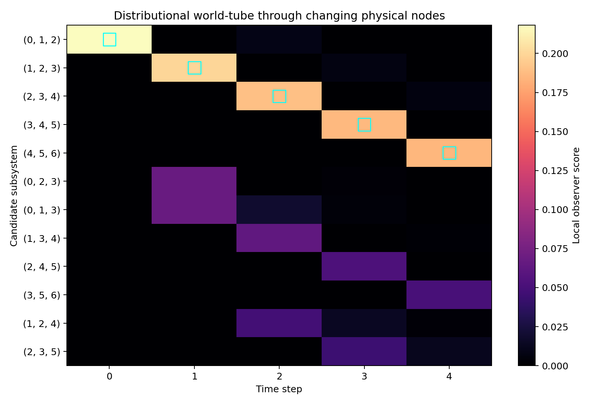](docs/reproducible_results.md) | [](docs/reproducible_results.md) |

A planted module moves through the coordinate system as

```text
(0,1,2) -> (1,2,3) -> (2,3,4) -> (3,4,5) -> (4,5,6)
```

**Physics interpretation:** think of a coherent structure crossing a sensor array. The physical organization can persist even though the sensor labels covering it change.

**What these figures do not establish:** they do not prove that every physical system contains a unique observer-like subsystem. They validate controlled constructions and expose failure regions.

## Phase II. Finite-sample and perturbation recovery

### Physical question

If the underlying dynamical structure is real but the measured covariance is noisy or the model is slightly perturbed, when does the recovered moving boundary remain unchanged?

| Finite-sample benchmark | Symbolic recovery region |
| --- | --- |
| [](docs/reproducible_results.md) | [](docs/reproducible_results.md) |

[](docs/reproducible_results.md)

**Physics interpretation:** a boundary should not change merely because an experiment is repeated with finite noise, unless uncertainty is large enough to erase the separation between the best path and its competitors.

## Phase III. Screening and localization

### Physical question

When the candidate space is large, can noncompetitive structures be removed without invalidating the confidence statement?

| Gaussian screen calibration | Structural-null screen |
| --- | --- |
| [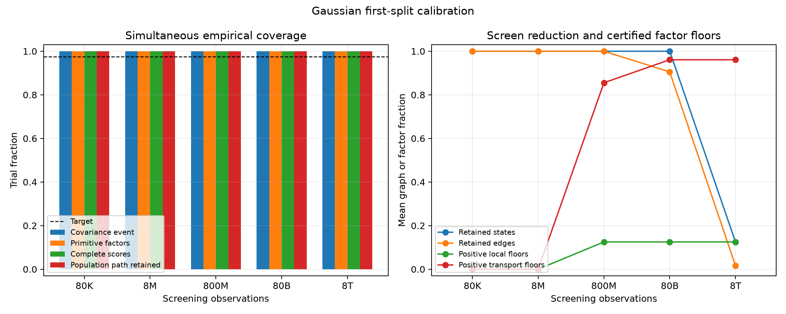](docs/reproducible_results.md) | [](docs/reproducible_results.md) |

| Trajectory-coupled screening | Relative covariance calibration |
| --- | --- |
| [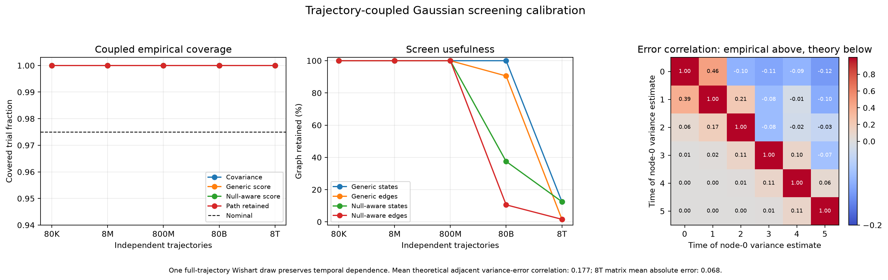](docs/reproducible_results.md) | [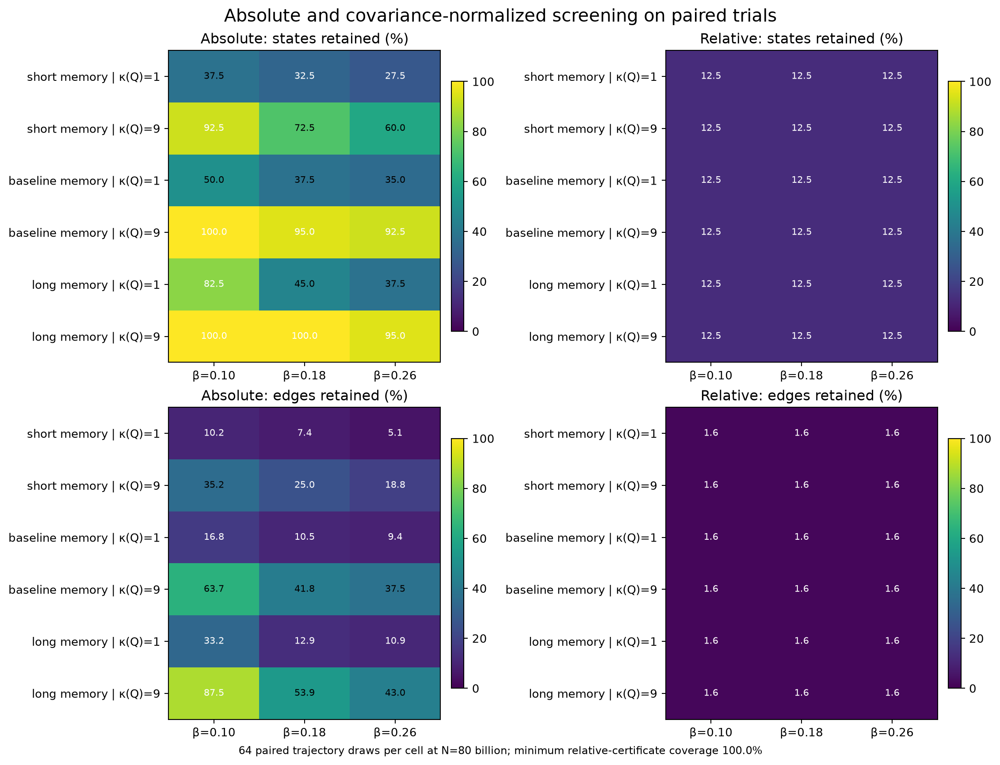](docs/reproducible_results.md) |

**Physics interpretation:** these are computational and statistical safeguards. They do not create physical structure. They protect a large boundary search from statistical circularity and unnecessary computation.

## Phase IV. Cross-fitting, drift, and changing populations

### Physical question

What happens when calibration, screening, or the measured population changes across an experiment?

| Cross-fitted calibration | Drift-robust calibration |
| --- | --- |
| [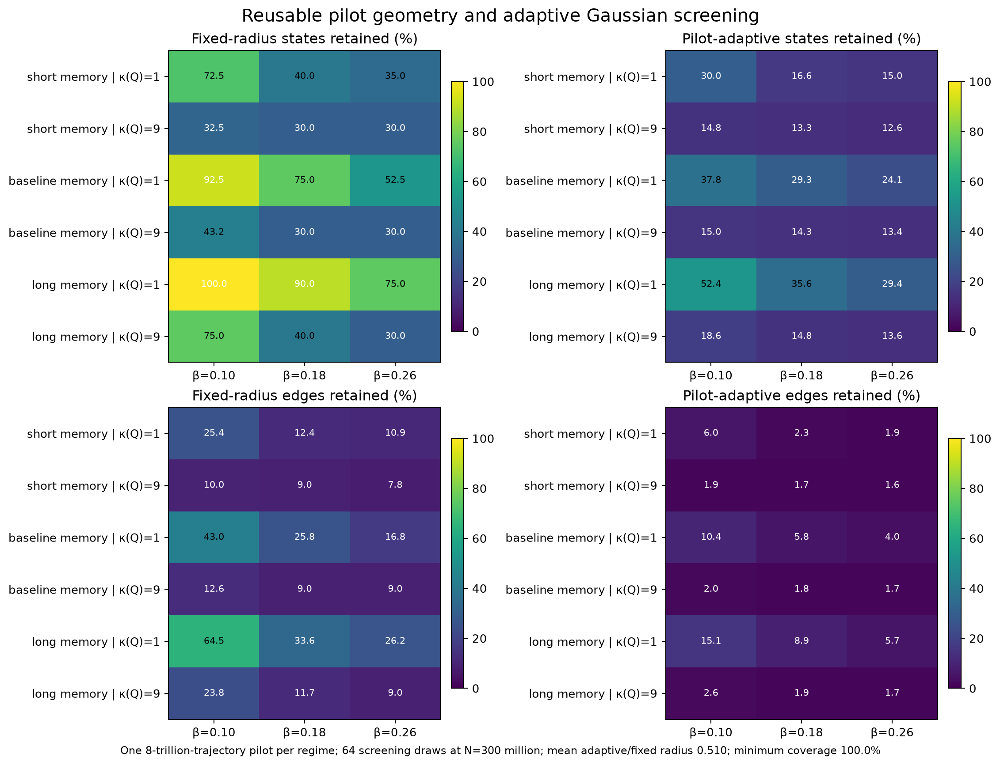](docs/reproducible_results.md) | [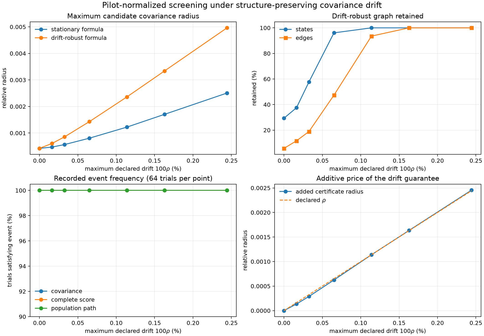](docs/reproducible_results.md) |

| Calibrated drift comparison | Multi-regime coupled calibration |
| --- | --- |
| [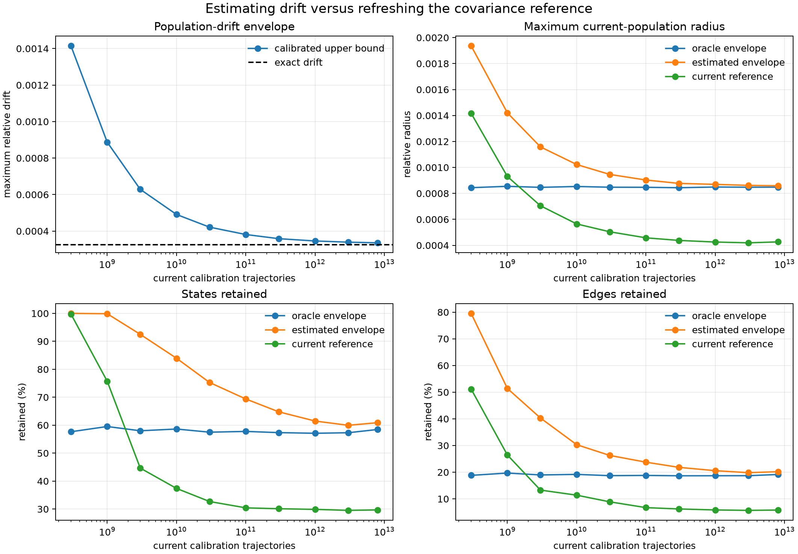](docs/reproducible_results.md) | [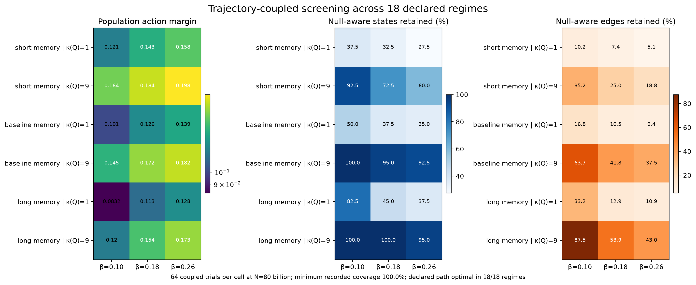](docs/reproducible_results.md) |

**Physics interpretation:** deterministic drift, changing regimes, and calibration reuse can imitate or obscure covariance structure. These experiments quantify the cost of protecting against those effects.

## Phase V. Temporally dependent measurements

### Physical question

A physical record has memory. How much independent information is really present when neighboring samples are correlated?

| Dependent Gaussian calibration | Unknown-mean dependent calibration |
| --- | --- |
| [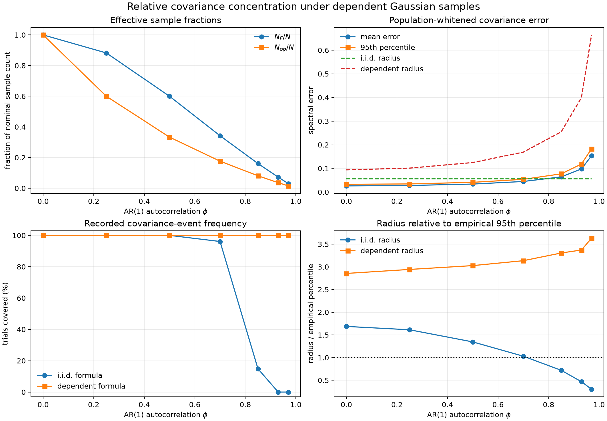](docs/reproducible_results.md) | [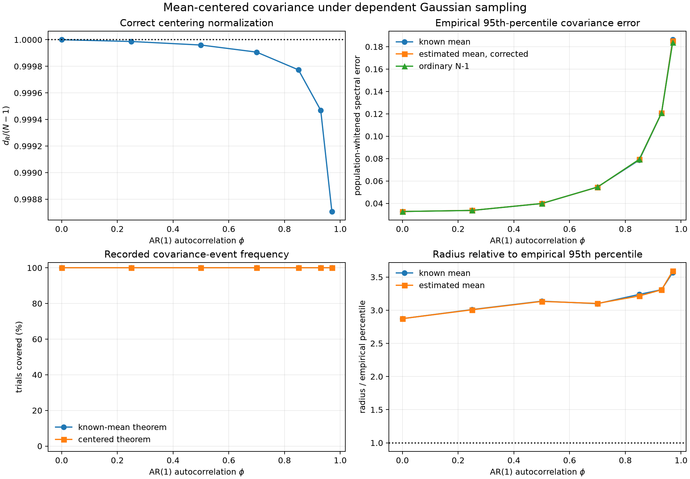](docs/reproducible_results.md) |

[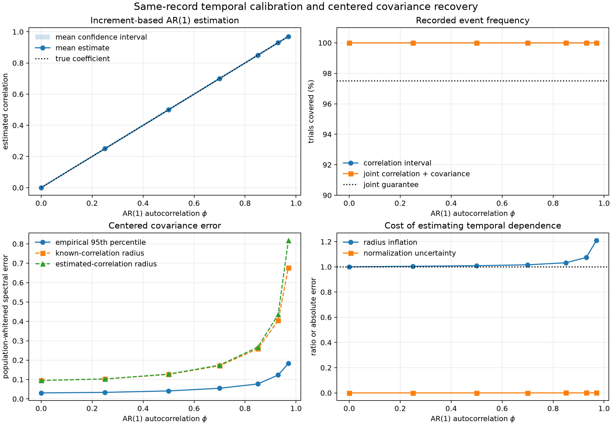](docs/reproducible_results.md)

**Physics interpretation:** repeatedly observing the same slowly relaxing fluctuation does not create as much independent information as observing independent realizations.

## Phase VI. Time-varying nuisance structure

### Physical question

Can deterministic baseline drift or a known temporal trend be removed without being mistaken for stochastic fluctuation covariance?

| Proposition 44, Experiment AD | Proposition 45, Experiment AE |
| --- | --- |
| [](docs/proposition_44_nuisance_projection.md) | [](docs/proposition_45_estimated_ar1_nuisance_projection.md) |

[](docs/proposition_46_design_specific_ar1_envelope.md)

**Physics interpretation:** a slow baseline, affine drift, or known instrument trend is not automatically part of the system's stochastic fluctuation geometry. Projection separates declared deterministic modes from covariance estimation.

## Phase VII. Direct matrix concentration

### Physical question

Can the complete fluctuation geometry be certified more tightly than by checking many separate directions?

| Proposition 47, Experiment AG | Proposition 48, Experiment AH |
| --- | --- |
| [](docs/proposition_47_weighted_wishart_matrix_chernoff.md) | [](docs/proposition_48_uniform_matrix_chernoff_ar1.md) |

[](docs/proposition_49_compact_temporal_family.md)

**Physics interpretation:** the theorem certifies the geometry of measured fluctuations. It does not turn covariance eigenmodes into physical energy modes unless a separate physical derivation supplies that meaning.

## Phase VIII. Learning temporal physics from calibration data

### Physical question

If temporal memory is not known in advance, can an independent calibration experiment determine which memory models remain compatible with the data?

| Proposition 50, Experiment AJ | Proposition 51, Experiment AK |
| --- | --- |
| [](docs/proposition_50_calibrated_temporal_family.md) | [](docs/proposition_51_evalue_temporal_confidence_set.md) |

[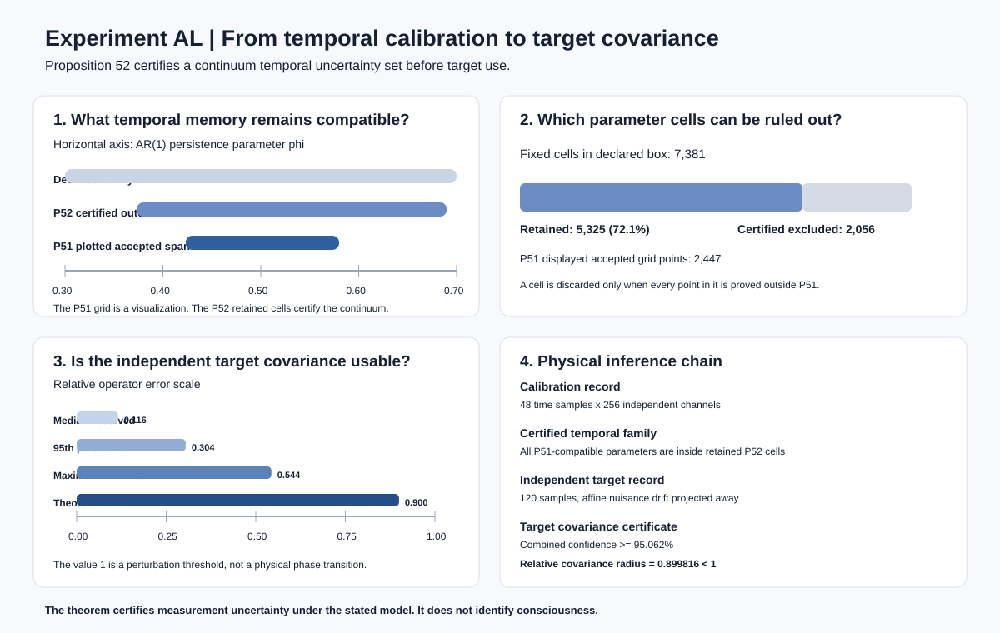](docs/proposition_52_certified_evalue_outer_cover.md)

**Physics interpretation:** these results do not identify one exact temporal law. They propagate uncertainty over temporal models that the calibration record has not ruled out.

## Phase IX. Sampling consistency, physical time, and exact local structure

### Physical question

Does a temporal parameter describe the physical process itself, or does it change because the experimenter changed the sampling clock? On an irregular record, what local stochastic structure corresponds exactly to the dense physical-time covariance?

| Sampling consistency | Irregular-grid Markov factorization |
| --- | --- |
| [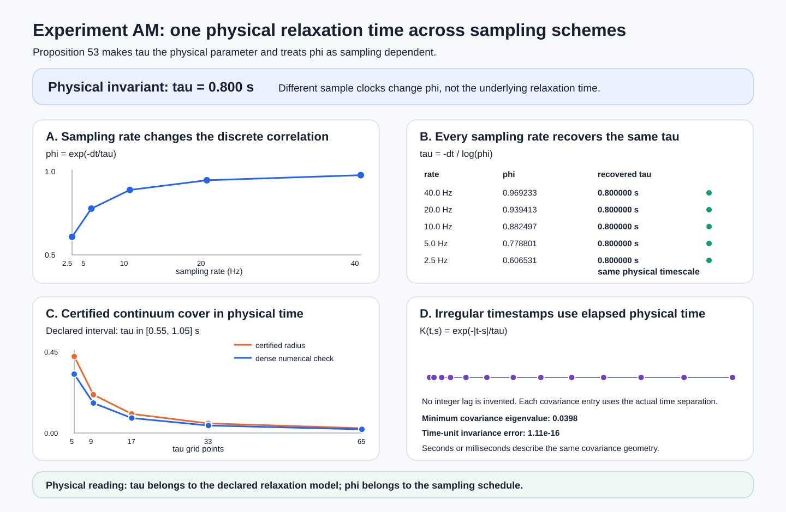](docs/proposition_53_physical_relaxation_time.md) | [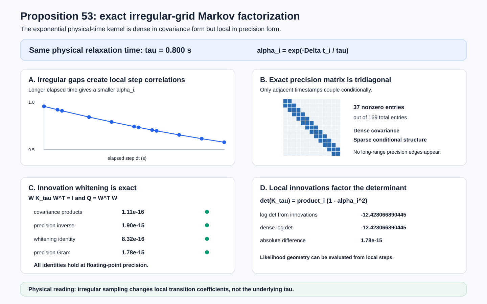](docs/proposition_53_physical_relaxation_time.md) |

[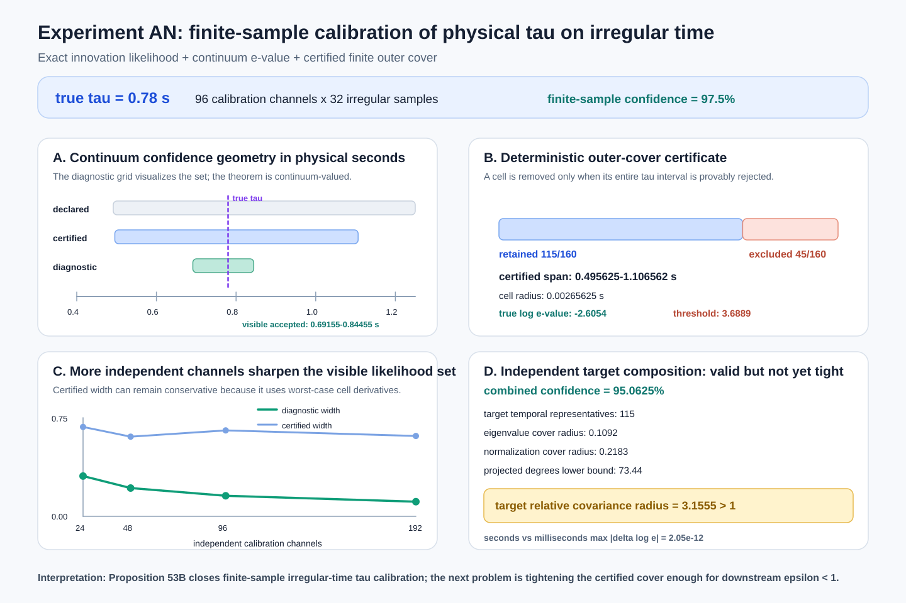](docs/proposition_53b_irregular_tau_evalue.md)

[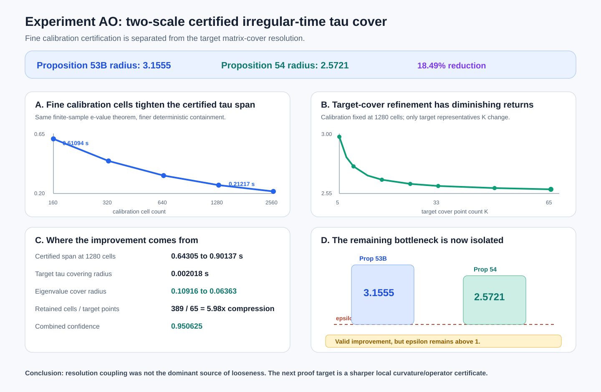](docs/proposition_54_two_scale_irregular_tau_cover.md)

[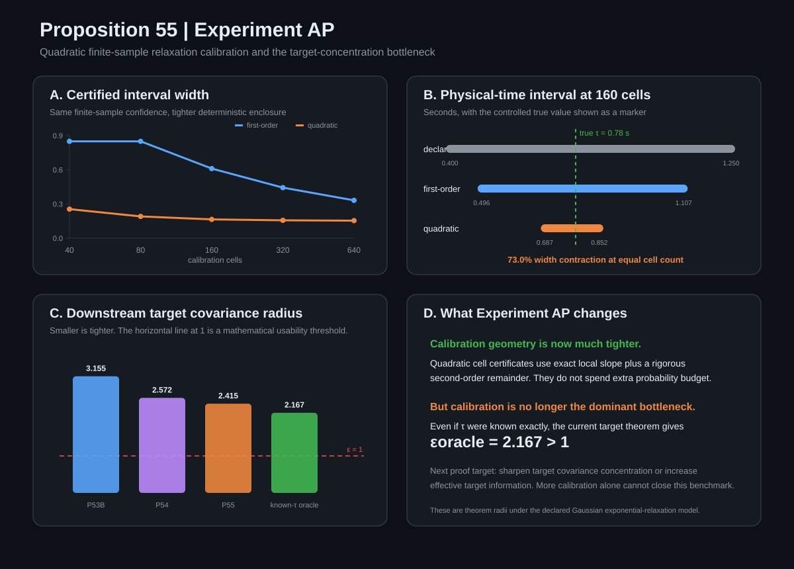](docs/proposition_55_quadratic_relaxation_calibration.md)

**Proposition 55 / Experiment AP:** the observed local likelihood slope and a rigorous cell-local curvature bound contract the 160-cell certified tau width from `0.61094 s` to `0.16469 s`, about `73.0%`, without spending additional probability budget. The target radius improves to `2.41488`. A known-tau oracle calculation still gives `2.16725 > 1`, showing that calibration uncertainty is no longer the dominant bottleneck on this target configuration.

**Proposition 54 / Experiment AO:** calibration certification and target temporal-cover resolution are now separated. Refining the calibration certificate from 160 to 2560 cells shrinks the certified tau width from `0.61094 s` to `0.21217 s`. On the exact Experiment AN target problem, the final relative covariance radius falls from `3.15549` to `2.57207`, an `18.49%` reduction. The radius remains above one, so the next bottleneck is the local temporal operator/likelihood envelope rather than cover-cardinality coupling.

**Proposition 53B / Experiment AN:** the same physical-time parameter is now calibrated directly from an irregular record with a finite-sample continuum e-value. The visible likelihood-compatible region is approximately `[0.69155, 0.84455] s`, while the certified outer cover is `[0.495625, 1.1065625] s`. The difference is an explicit tightness gap, not a coverage failure.

For the controlled exponential model,

\[
\tau=0.8\ \mathrm{s}.
\]

Sampling at 40 Hz, 20 Hz, 10 Hz, 5 Hz, and 2.5 Hz produces different one-step correlations, but every value maps back to the same \(0.8\) s relaxation time.

The exact uniform-grid consistency rule is

\[
\boxed{
\phi_{k\Delta t}=\phi_{\Delta t}^k
}.
\]

For irregular gaps, local transitions obey

\[
\boxed{
\alpha_i=e^{-(t_{i+1}-t_i)/\tau}
}
\]

and multiply to the exact long-range covariance. The corresponding temporal precision matrix is tridiagonal, and the innovation whitener makes the temporal covariance identity exactly.

**How to read the left figure:** panel A shows that \(\phi\) changes with acquisition rate. Panel B shows that recovered \(\tau\) remains fixed. Panel C compares the analytic continuum-cover radius with a dense numerical visibility check. Panel D shows that irregular timestamps use actual elapsed physical time.

**How to read the right figure:** panel A maps irregular elapsed gaps to local transition correlations. Panel B shows the exact tridiagonal precision pattern. Panel C records whitening and inverse identities at floating-point precision. Panel D shows the exact determinant factorization from local innovation variances.

**What these figures do not establish:** they do not show that every physical system has one exponential timescale or a nearest-neighbor temporal precision graph. Those conclusions are conditional on the declared exponential Gaussian model and must be tested in a real application.

---

# 5. Complete theorem roadmap, Proposition 1 to Proposition 55

The project did not begin with temporal calibration. The recent results sit on top of a longer recovery, identifiability, and finite-sample program.

## Layer A. Foundations and first recovery theory, Propositions 1 to 14

| Proposition | Role in the program | Physical reading |
| ---: | --- | --- |
| 1 | Adjacent-state covariance for time-varying linear Gaussian dynamics | Relates present fluctuations, next-state fluctuations, and one-step coupling |
| 2 | Representation invariance of canonical transport inside declared blocks | Transport should not depend on an invertible coordinate change inside the same declared physical block |
| 3 | Bounded transport score | Keeps the operational transport score in a controlled dimensionless range |
| 4 | Finite-horizon path robustness | Converts path separation into tolerance against score error |
| 5 | Componentwise planted-path recovery | Gives a sufficient condition for exact moving-path recovery |
| 6 | Finite-sample recovery from simultaneous score bounds | Connects statistical score accuracy to path recovery probability |
| 7 | Gaussian conditional-information perturbation | Controls information quantities when covariance is uncertain |
| 8 | Canonical-persistence perturbation | Controls predictive persistence when covariance is uncertain |
| 9 | End-to-end Gaussian sample complexity | Connects sample size to correct path recovery under the Gaussian model |
| 10 | Positive-factor geometric-score stability | Gives sharper local behavior when score factors stay away from zero |
| 11 | Localized finite-sample path certificate | Uses only covariance blocks relevant to each candidate |
| 12 | Parameter-level linear-Gaussian certificate | Connects \(A_t\), \(Q_t\), covariance, and recovery in one chain |
| 13 | Objective identifiability modulo symmetry | Separates true ambiguity from coordinate relabeling |
| 14 | Two-model impossibility bound | Shows when available observations cannot distinguish incompatible labels |

Detailed proofs: [Propositions 1 to 43 proof record](docs/proofs_and_conjectures.md).

## Layer B. Structural compression and moving-partition theory, Propositions 15 to 31

This layer develops exact competitor structure, symbolic moving-clique recovery, perturbation propagation, structural-null control, overlap classes, influence cones, class compression, interval-certified classes, residual bounds, and screened environmental recovery.

| Range | Main question |
| --- | --- |
| 15 to 20 | Which competitors can threaten the optimum, and how robust is a structured moving clique? |
| 21 to 25 | Which covariance blocks and overlap classes can influence a candidate score? |
| 26 to 31 | How can moving partitions, class compression, interval certificates, and environmental screening be combined without losing correctness? |

Detailed proofs: [Propositions 15 to 31](docs/proofs_and_conjectures.md).

## Layer C. Statistical screening and drift, Propositions 32 to 40

| Proposition | Main role |
| ---: | --- |
| 32 | Independent sample-split confidence composition |
| 33 | Gaussian first-split screening safety |
| 34 | Positive-factor refinement of Gaussian screening |
| 35 | Structural-null screening at score boundaries |
| 36 | Trajectory-coupled Gaussian screening |
| 37 | Covariance-normalized Gaussian screening |
| 38 | Pilot-normalized adaptive screening |
| 39 | Drift-robust pilot-normalized screening |
| 40 | Statistically calibrated population drift |

**Physical role:** this layer protects boundary inference against data reuse, large candidate spaces, and changing population structure before the temporal-memory problem is introduced.

## Layer D. Dependent measurements and temporal calibration, Propositions 41 to 52

| Proposition | Mathematical question | Physical question |
| ---: | --- | --- |
| 41 | How does temporal dependence alter covariance concentration? | How much independent information is really in a record with memory? |
| 42 | What changes when an unknown constant mean is removed? | How does baseline removal change usable fluctuation information? |
| 43 | Can a shared nonnegative AR(1) coefficient be estimated? | Can discrete persistence be learned instead of assumed? |
| 44 | Can the target mean vary inside a declared temporal subspace? | Can known drift shapes be removed without corrupting fluctuation covariance? |
| 45 | Can temporal calibration and nuisance projection be combined? | Can memory uncertainty and deterministic drift be handled together? |
| 46 | Can actual nuisance geometry replace a rank-only worst case? | Does the real shape of removed drift modes change the information budget? |
| 47 | Can direct matrix concentration replace a sphere-net reduction? | Can complete fluctuation geometry be certified directly? |
| 48 | Can the matrix bound survive unknown AR(1)? | Does the covariance guarantee survive uncertainty in discrete persistence? |
| 49 | Can a compact temporal family be covered? | Can a full admissible family of memory kernels be propagated safely? |
| 50 | Can a two-parameter temporal family be learned from calibration data? | Can persistence and fast uncorrelated variance be estimated independently of the target record? |
| 51 | Can full likelihood produce a continuum confidence set? | Which temporal models remain compatible with the complete calibration record? |
| 52 | Can that continuum set be certified for target use? | Can every still-compatible temporal model be carried into an independent target covariance guarantee? |

Direct proof pages: [P44](docs/proposition_44_nuisance_projection.md), [P45](docs/proposition_45_estimated_ar1_nuisance_projection.md), [P46](docs/proposition_46_design_specific_ar1_envelope.md), [P47](docs/proposition_47_weighted_wishart_matrix_chernoff.md), [P48](docs/proposition_48_uniform_matrix_chernoff_ar1.md), [P49](docs/proposition_49_compact_temporal_family.md), [P50](docs/proposition_50_calibrated_temporal_family.md), [P51](docs/proposition_51_evalue_temporal_confidence_set.md), [P52](docs/proposition_52_certified_evalue_outer_cover.md).

## Layer E. Sampling-consistent physical representation and inference, Proposition 53

| Proposition | Mathematical question | Physical question |
| ---: | --- | --- |
| 53A | Can the exponential temporal family be parameterized by a physical relaxation time and factorized exactly on arbitrary increasing timestamps? | Does the inferred timescale survive sampling changes, and does the same physical model retain a local transition law under irregular or missing observations? |
| 53B | Can the physical relaxation time itself be calibrated with finite-sample coverage directly on irregular timestamps? | Which physical timescales remain compatible with an irregular calibration record, independent of the target experiment's sampling schedule? |

[Proposition 53A proof](docs/proposition_53_physical_relaxation_time.md) | [Proposition 53B proof](docs/proposition_53b_irregular_tau_evalue.md).


## Layer F. Two-scale physical-time uncertainty propagation, Proposition 54

| Proposition | Mathematical question | Physical question |
| ---: | --- | --- |
| 54 | Can calibration certification resolution be separated from target temporal-cover resolution without losing finite-sample validity? | Can a physical timescale be certified finely while propagating only a compressed family into an independent target experiment? |

[Proposition 54 proof](docs/proposition_54_two_scale_irregular_tau_cover.md).

## Layer G. Local likelihood curvature, Proposition 55

| Proposition | Mathematical question | Physical question |
| ---: | --- | --- |
| 55 | Can exact local likelihood slope and a certified second derivative replace a first-order worst case when enclosing the physical relaxation-time confidence set? | How sharply does the observed irregular calibration record constrain nearby physical timescales, and where does calibration stop being the dominant source of target uncertainty? |

[Proposition 55 proof](docs/proposition_55_quadratic_relaxation_calibration.md).

---

# 6. Latest physical-statistical result, Proposition 53B and Experiment AN

[](docs/proposition_53b_irregular_tau_evalue.md)

Proposition 53 now has two linked stages: **53A** establishes sampling-consistent physical time and exact irregular-grid Markov structure; **53B** uses that structure to calibrate the physical relaxation time directly with a finite-sample continuum e-value.

| Sampling invariance | Exact irregular-grid local structure |
| --- | --- |
| [](docs/proposition_53_physical_relaxation_time.md) | [](docs/proposition_53_physical_relaxation_time.md) |

The theorem starts from actual sample times:

\[
R_\tau(i,j)
=
\exp\left(-\frac{|t_i-t_j|}{\tau}\right).
\]

It now proves:

- exact equivalence with uniformly sampled AR(1) covariance;
- exact coarse-sampling consistency;
- invariance under a change of time units;
- positive-semidefinite covariance on irregular timestamps;
- an analytic operator-Lipschitz bound over a declared \(\tau\)-interval;
- a deterministic finite cover that composes with Proposition 49;
- an exact irregular-grid Gaussian transition factorization;
- an exact lower-bidiagonal temporal whitener;
- an exact tridiagonal temporal precision matrix;
- an exact determinant and log-determinant factorization;
- exact transition and innovation composition when intermediate samples are missing.

For Experiment AM, \(\tau=0.8\) s and the observed one-step coefficients are approximately:

| Sampling rate | \(\phi\) | Recovered \(\tau\) |
| ---: | ---: | ---: |
| 40 Hz | 0.969233 | 0.800000 s |
| 20 Hz | 0.939413 | 0.800000 s |
| 10 Hz | 0.882497 | 0.800000 s |
| 5 Hz | 0.778801 | 0.800000 s |
| 2.5 Hz | 0.606531 | 0.800000 s |

For the irregular-grid cover over

\[
\tau\in[0.55,1.05]\ \mathrm{s},
\]

the certified operator radius decreases from about `0.4160` with 5 grid points to about `0.0260` with 65 grid points. Dense numerical evaluation remains below the analytic certificate at every recorded resolution.

For the 13-time-point irregular Markov diagnostic at \(\tau=0.8\) s:

| Exact identity diagnostic | Maximum numerical error |
| --- | ---: |
| long-range covariance from local step products | `1.11e-16` |
| tridiagonal precision times dense covariance | `1.90e-15` |
| temporal whitening to identity | `8.32e-16` |
| precision as \(W_\tau^\mathsf T W_\tau\) | `1.78e-15` |
| local innovation log determinant vs dense log determinant | `1.78e-15` |

Only **37 of 169** entries of the exact temporal precision matrix are nonzero.

The numerical evaluations are visibility checks. The continuum guarantee comes from the analytic derivative bound, and the Markov, whitening, precision, and determinant identities come from the exact Proposition 53 derivation.

[Full proof](docs/proposition_53_physical_relaxation_time.md) | [0.41.1 research record](docs/release_0_41_1.md) | [Machine-readable results](docs/physical_relaxation_sampling.json) | [Experiment script](examples/physical_relaxation_sampling.py) | [Sampling renderer](examples/render_physical_relaxation_sampling.py) | [Markov renderer](examples/render_physical_relaxation_markov.py) | [Claim-level tests](tests/test_physical_relaxation.py)

### Proposition 53B: finite-sample physical-time calibration

For Experiment AN, the true value is `tau = 0.78 s`. At 97.5% calibration confidence the continuum e-value diagnostic accepts approximately `[0.69155, 0.84455] s` on a 2001-point visibility grid. A deterministic cell-local derivative certificate safely retains `[0.495625, 1.1065625] s`, with 115 of 160 cells retained and 45 excluded.

Changing seconds to milliseconds changes the checked log e-values by at most `2.05e-12`, confirming that the inference geometry is about physical time rather than the numerical unit used to write it.

The retained family composes with Proposition 49 on a different independent 120-sample target timestamp grid. With calibration and target covariance confidence both `0.975`, the combined confidence is `0.950625`.

The current target relative covariance radius is **`3.1554895445 > 1`**. This is an important limitation: the finite-sample calibration theorem is valid, but the current deterministic cover is still too conservative for downstream inverse-covariance perturbation theorems that require `epsilon < 1`. Tightening that cover is the next proof target.

[Proposition 53B proof](docs/proposition_53b_irregular_tau_evalue.md) | [0.42.0 research record](docs/release_0_42.md) | [Experiment AN JSON](docs/irregular_relaxation_evalue_calibration.json) | [Experiment AN script](examples/irregular_relaxation_evalue_calibration.py) | [AN renderer](examples/render_irregular_relaxation_evalue.py) | [53B theorem tests](tests/test_irregular_relaxation_evalue.py)

---

# 7. Latest tightening result, Proposition 54 and Experiment AO

[](docs/proposition_54_two_scale_irregular_tau_cover.md)

Proposition 54 decouples the fine partition used to certify the continuum physical-time confidence set from the smaller target temporal cover used by Proposition 49.

On Experiment AO, the Proposition 53B baseline radius `3.1554895445` falls to `2.5720746948`, a reduction of approximately `18.49%`, at the same combined confidence `0.950625`.

The result is deliberately not presented as closing the downstream perturbation problem: `2.57207 > 1`. Instead it shows that target-cover cardinality was only part of the looseness. The next proof target is a sharper local curvature or operator certificate.

[Full Proposition 54 proof](docs/proposition_54_two_scale_irregular_tau_cover.md) | [0.43.0 research record](docs/release_0_43.md) | [Experiment AO JSON](docs/two_scale_irregular_tau_cover.json) | [Experiment AO script](examples/two_scale_irregular_tau_cover.py)

---

# 8. Latest calibration-curvature result, Proposition 55 and Experiment AP

[](docs/proposition_55_quadratic_relaxation_calibration.md)

Proposition 55 replaces the first-order calibration-cell envelope by an exact observed-data log-evalue slope plus a rigorous cell-local second-order remainder. On the Experiment AP benchmark, the certified 160-cell physical-time width contracts from `0.6109375 s` to `0.1646875 s` while preserving the same finite-sample calibration confidence.

The end-to-end radius improves from `3.1554895445` in Proposition 53B and `2.5720746948` in Proposition 54 to `2.4148799294`. The most important diagnostic is the known-tau oracle radius:

\[
\boxed{
\varepsilon_{\mathrm{oracle}}=2.167246895150515>1
}
\]

Thus further calibration tightening alone cannot make this target configuration enter the `epsilon < 1` perturbative regime. The next target is the covariance concentration layer itself.

[Full Proposition 55 proof](docs/proposition_55_quadratic_relaxation_calibration.md) | [0.44.0 research record](docs/release_0_44.md) | [Experiment AP JSON](docs/quadratic_relaxation_calibration.json) | [Experiment AP script](examples/quadratic_relaxation_calibration.py) | [AP renderer](examples/render_quadratic_relaxation_calibration.py)

---

# 9. Latest statistical certification result, Proposition 52 and Experiment AL

[](docs/proposition_52_certified_evalue_outer_cover.md)

Proposition 51 defines a continuum temporal confidence set \(\mathcal C_\alpha(Z)\). Proposition 52 constructs a certified retained region \(\mathcal O_\alpha(Z)\) and proves

\[
\boxed{
\mathcal C_\alpha(Z)
\subseteq
\mathcal O_\alpha(Z)
}.
\]

The retained region can be propagated to an independent target covariance certificate.

In Experiment AL, 5,325 of 7,381 cells are retained, 2,056 are certified excluded, and the final relative target covariance radius is

\[
\boxed{0.8998157009696983<1}
\]

at combined confidence lower bound

\[
0.975^2=0.950625.
\]

The target trials are diagnostics. The guarantee comes from the Proposition 51 e-value result, deterministic cell containment, and conditional Proposition 49 matrix concentration.

---

# 10. What covariance means physically

For a fluctuating multivariate system,

\[
\Sigma
=
\mathbb E[(X-\mu)(X-\mu)^\top]
\]

describes fluctuation geometry.

- diagonal entries are coordinate variances;
- off-diagonal entries describe co-fluctuation;
- eigenvectors describe collective fluctuation directions;
- eigenvalues describe variance along those directions.

These eigenvalues are **not automatically physical energies**. An energy interpretation requires a separate derivation connecting the coordinates and covariance to a Hamiltonian, temperature, power spectrum, or another physically defined energetic quantity.

See the [Physics Guide](docs/physics_guide.md) and [Figure Reading Guide](docs/figure_reading_guide.md).

---

# 11. Identifiability before interpretation

Optimization is not identifiability.

If two admissible models produce the same declared observational law while assigning incompatible labels outside the allowed symmetry class, no estimator using only those observations can uniformly recover both labels.

The standing rule is:

> **Every recovery statement is relative to declared observables, modeling assumptions, candidate families, and admissible symmetries.**

A physically serious application should document observables, units, sampling schedule, preprocessing, effective coupling model, nuisance modes, temporal assumptions, candidate geometry, and explicit model-failure tests.

---

# 12. What this repository establishes

Under its stated assumptions, the repository provides a conditional mathematical pipeline for:

- defining observer-like subsystem scores;
- optimizing moving subsystem paths;
- quantifying exact optimization margins;
- proving path stability under deterministic perturbations;
- deriving finite-sample Gaussian covariance guarantees;
- establishing identifiability conditions and impossibility results;
- screening large candidate spaces with explicit confidence accounting;
- handling temporally dependent observations;
- removing declared nuisance means and drifts;
- learning uncertain temporal-memory models from independent calibration data;
- constructing a finite-sample continuum confidence set for a temporal family;
- turning that continuum set into a certified finite outer cover;
- propagating retained temporal uncertainty into an independent target covariance certificate;
- representing a single exponential temporal model by a physical relaxation time;
- calibrating that physical relaxation time directly on irregular timestamps with finite-sample continuum coverage;
- certifying a finite outer cover of the retained physical-time family and propagating it to an independent target grid;
- preserving that model across uniform, coarse, irregular, missing-sample, and unit-rescaled time coordinates;
- factorizing the irregular-grid exponential covariance into exact local Gaussian innovations;
- whitening its temporal dependence exactly under the declared model;
- expressing its inverse covariance as an exact tridiagonal precision matrix;
- evaluating its determinant from local innovation variances.

## What is not established

The repository does not establish that every physical system has a unique observer boundary. It does not establish that Gaussianity, separability, the exponential relaxation model, nearest-neighbor temporal precision, or the current temporal families hold in a particular experiment without validation. It does not establish consciousness.

Any future observer-to-consciousness interpretation must enter as an additional bridge hypothesis and satisfy the falsifiability, invariance, identifiability, causal, and competing-explanation requirements in the [Interpretation Protocol](docs/interpretation_protocol.md).

---

# 13. How to read the repository

| If you want to understand... | Start here |
| --- | --- |
| The primary conceptual source and full literature lineage | [Bibliography and Citation Map](docs/bibliography.md) |
| The physical meaning of the equations | [Physics Guide](docs/physics_guide.md) |
| What every major figure means | [Figure Reading Guide](docs/figure_reading_guide.md) |
| The complete research story | [Research Overview](docs/research_overview.md) |
| The proposition and experiment map | [Research Index](docs/research_index.md) |
| Propositions 1 to 43 in full detail | [Proof record](docs/proofs_and_conjectures.md) |
| Propositions 44 to 55 | [Research Index](docs/research_index.md) |
| Assumptions and failure conditions | [Assumption Ledger](docs/assumption_ledger.md) |
| Public temporal and sampling API | [Temporal Calibration API](docs/api_temporal_calibration.md) |
| Recent release history | [Recent Release History](docs/recent_release_history.md) |
| Release 0.44.0 audit | [0.44.0 Research Record](docs/release_0_44.md) |
| Release 0.43.0 audit | [0.43.0 Research Record](docs/release_0_43.md) |
| Release 0.42.0 audit | [0.42.0 Research Record](docs/release_0_42.md) |
| Previous 0.41.1 audit | [0.41.1 Research Record](docs/release_0_41_1.md) |
| Rules for any future consciousness interpretation | [Interpretation Protocol](docs/interpretation_protocol.md) |

---

# 14. Reproducibility standard

A result is considered complete here only when the relevant pieces exist together:

- physical problem statement when a physical reading is intended;
- declared measurement model;
- precise mathematical statement;
- assumptions stated close to the claim;
- proof or derivation;
- implementation;
- claim-level tests;
- reproducible experiment when a numerical comparison is useful;
- machine-readable results for committed numerical claims;
- visible figure when a figure improves understanding;
- explicit statement of what the result does not establish;
- front-page or index link so the result is discoverable.

The documentation style check rejects Unicode en dash and em dash characters in Markdown files.

```bash
python -m pip install -e ".[dev]"
pytest
ruff check .
```

---

# 15. Current frontier

Propositions 53B through 55 now separate three questions that were previously entangled: finite-sample calibration of a physical relaxation time, numerical compression of the retained temporal family, and local likelihood geometry.

Experiment AP shows that the calibration layer can now be made much tighter. At 160 cells the certified relaxation-time width contracts by about `73.0%` relative to the first-order enclosure.

The known-tau oracle calculation changes the research priority. Even when temporal-parameter uncertainty is removed completely, the current target covariance theorem gives

\[
\boxed{
\varepsilon_{\mathrm{oracle}}=2.167246895150515>1.
}
\]

For this benchmark, additional calibration sharpening alone cannot cross the perturbative threshold one.

The immediate statistical frontier is therefore the **target covariance concentration problem** itself. Candidate directions include a sharper design-specific matrix concentration theorem, a concentration argument that exploits the exact irregular-grid innovation whitening more directly, and explicit target-information requirements showing how sample duration, timestamp geometry, block dimension, and nuisance rank control the attainable radius.

The broader physics frontiers remain model falsification beyond one exponential timescale, sensor-coordinate invariance, spatial coarse graining, and intervention-sensitive identifiability.

The guiding question remains:

> **Which inferred structures belong to the underlying dynamical organization, and which are artifacts of measurement representation or insufficient information?**

That question remains separate from any claim about consciousness.

---

# 16. Citation, bibliography, and conceptual source

The **primary conceptual source and starting point for this research program** is:

**Tegmark, M. (2015).** [*Consciousness as a State of Matter*](https://doi.org/10.1016/j.chaos.2015.03.014). *Chaos, Solitons & Fractals*, **76**, 238-270. Technical preprint: [arXiv:1401.1219](https://arxiv.org/abs/1401.1219).

The complete literature record, including the role of every major external source used in the conceptual framing, information-theoretic definitions, canonical correlation, dynamic programming, Gaussian concentration, random-matrix concentration, e-value statistics, physical relaxation, and Gaussian Markov-process lineage, is maintained in the **[Bibliography and Citation Map](docs/bibliography.md)**.

Machine-readable BibTeX: [`references.bib`](references.bib).

For citation of this repository and research software, see [CITATION.cff](CITATION.cff).

License: [MIT](LICENSE).
