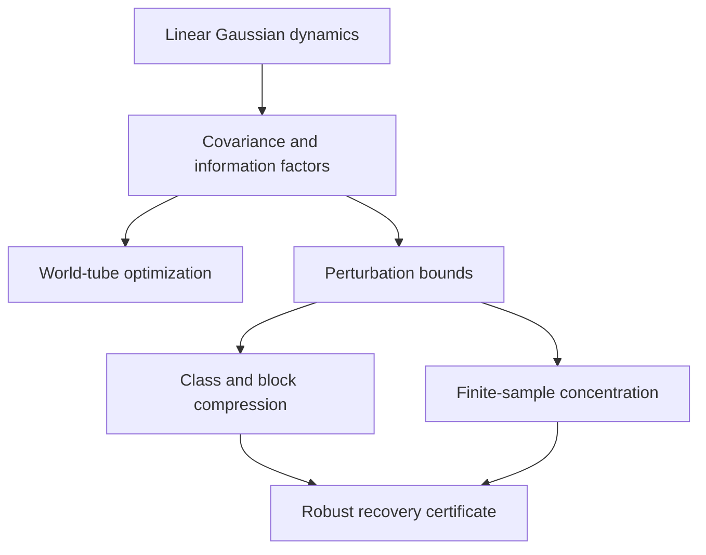

# Reader guide

This repository studies a concrete identification problem: whether a changing
subset of variables can be distinguished from competing subsets by its internal
dynamics, insulation from external predictive drive, and persistence through
time. The word *observer* names that mathematical role. It does not assert
subjective experience.

## Where to begin

A first reading does not require following every perturbation constant.

1. Read the [Research overview](research_overview.md) for the complete map of
   results, evidence, code, and limitations.
2. Read the question and interpretation boundary in the [README](../README.md).
3. Read [Mathematical framework](mathematical_framework.md) for the score and
   path objective.
4. Read [Space, time, and observer identity](space_time_observer.md) for the
   conceptual motivation and scope.
5. Run `python examples/worldtube_experiment.py` to see the basic inference
   problem.
6. Use [Derivations](derivations.md) and
   [Proved results and open problems](proofs_and_conjectures.md) for the formal
   arguments.
7. Consult the [Assumption ledger](assumption_ledger.md) before interpreting a
   theorem or numerical certificate.

The [API guide](api.md) is organized in the same order as the mathematical
development. The [Reproducible results](reproducible_results.md) page records
the outputs produced by committed scripts.

## The research question in symbols

Let \(X_t\in\mathbb R^n\) be the observed process. A candidate boundary at time
\(t\) is a subset \(S_t\) of coordinates, and a candidate history is

\[
\mathcal W=(S_0,S_1,\ldots,S_{T-1}).
\]

The local score \(\Omega_t(S_t)\) is the geometric mean of three bounded
factors:

- integration across the weakest internal bipartition;
- insulation from predictive environmental drive;
- canonical-correlation persistence into the next state.

The path action adds local evidence, transport between consecutive boundaries,
and a penalty for changing physical membership. The optimizer is exact for the
declared finite candidate family. Recovery theorems ask the harder question:
under what assumptions must the intended path be the unique optimizer?

## How the results fit together



The repository contains four kinds of statement:

| Kind | Meaning |
| --- | --- |
| Identity | An exact formula under its stated model assumptions |
| Deterministic bound | A guarantee for every perturbation inside a declared envelope |
| Statistical guarantee | A probability statement under an explicit sampling model |
| Experiment | A reproducible calculation on a specified synthetic construction |

An experiment is not promoted to a theorem, and a sufficient theorem is not
presented as necessary.

## Essential notation

| Symbol | Meaning |
| --- | --- |
| \(X_t\) | Complete observed state at time \(t\) |
| \(S_t\) | Candidate subsystem boundary |
| \(E_t\) | Complement of \(S_t\), called its environment |
| \(\Omega_t\) | Local observer-like score |
| \(\Theta_t\) | Transport score between consecutive candidates |
| \(\chi\) | Weight on transport |
| \(\lambda\) | Nonnegative weight on membership discontinuity |
| \(A(\mathcal W)\) | Complete path action |
| \(m,M\) | Lower and upper covariance eigenvalue bounds |
| \(\eta\) | Observation or estimation covariance error radius |
| \(r\) | Population covariance residual around a representative |
| \(K\) | Number of declared candidate classes |
| \(T\) | Number of scored time layers |

The same letter can acquire time or class indices when the quantity varies.
All logarithmic information quantities are measured in bits unless stated
otherwise.

## What a positive certificate means

A positive recovery slack proves that every admissible perturbation preserves
the declared planted path as the unique optimizer within the declared candidate
family. The conclusion is only as broad as its assumptions: candidate coverage,
spectral envelopes, class multiplicities, block comparisons, and any omitted
leakage bounds must all be valid.

A nonpositive slack is inconclusive. It can mean that the planted path truly
loses, or only that the bound is too conservative. The numerical optimizer and
the certificate answer different questions and should both be reported.

## What this work does not establish

The framework does not prove consciousness, sentience, moral status, or a
unique metaphysical decomposition of nature. It does not show that the present
score is the only reasonable observer criterion. It currently assumes fully
observed linear Gaussian dynamics for its strongest analytical statements.

The project is useful precisely because these limits are explicit. It provides
a controlled setting in which proposed criteria can be proved, falsified,
stress-tested, and compared before broader interpretation is attempted.

## Reproducing and reviewing the work

From the repository root:

```bash
python -m pip install -e ".[dev,viz]"
python -m pytest
python -m ruff check .
```

Each result table in [Reproducible results](reproducible_results.md) names its
generating command. Tests tied to scientific claims are listed in
[Experimental protocol](experimental_protocol.md). A reviewer who finds a
counterexample should record the violated proposition, the smallest failing
construction, and whether the failure concerns an assumption, proof, or
implementation.

## Current frontier

The deterministic chain from block structure to robust class recovery is now
implemented. Independent sample-split confidence composition is also explicit.
Gaussian first-split concentration now proves screening safety for fixed
candidate blocks and deterministic spectral envelopes. The main unresolved
statistical issue is sharpness and calibration. Positive empirical factor
floors now provide a valid local Lipschitz refinement, while boundary entries
retain the zero-safe product-root bound. The first exact-Wishart calibration
finds no coverage failure in its limited run but shows that graph reduction can
still require extreme sample counts. A second calibration now draws the full
trajectory covariance at once, preserves cross-time dependence, and again
records complete coverage in 128 trials per scale. Higher-precision multi-regime
calibration and directional covariance refinements are the next checks.

Proposition 35 addresses the exact-zero part of this bottleneck. A structural
integration null fixed before screening yields a quadratic information bound
and changes the corresponding local-score rate from \(N^{-1/6}\) to
\(N^{-1/3}\). This is a conditional refinement, not a procedure for discovering
nulls from small empirical scores. Multi-regime calibration and independently
justified construction of null masks are now the next checks.

The coupled calibration also corrected the first mask: covariance memory makes
seven non-planted states weakly positive, leaving 28 rather than 35 exact nulls.
That correction is retained in the experiment, tests, figure, and result table.
