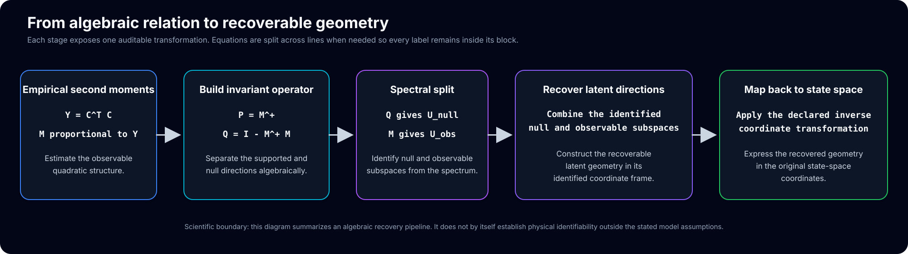

# Recoverable geometry pipeline

## Purpose

This figure provides a compact visual summary of an algebraic recovery path used in the observer-identification program. Its role is explanatory: it shows how an observable second-moment relation can be converted into invariant algebraic objects, separated into spectral subspaces, assembled into recoverable latent directions, and then interpreted back in the declared state-space coordinates.

The diagram is intentionally conservative about its final two stages. It does not insert an unverified closed-form equation for latent-coordinate recovery. The exact recovery map depends on the model, coordinate declaration, rank conditions, and identifiability assumptions established elsewhere in the repository.

## Reading the five stages

1. **Empirical second moments.** The observable quadratic relation begins with a matrix such as

   \[
   Y=C^{\mathsf T}C,
   \]

   together with a declared algebraic object \(M\) constructed from the measured relation.

2. **Invariant operator.** The pseudoinverse and associated projector-like expression

   \[
   P=M^+,
   \qquad
   Q=I-M^+M
   \]

   separate information supported by the observed operator from directions in its null structure.

3. **Spectral split.** Spectral information from \(Q\) and \(M\) identifies null and observable subspaces under the stated rank and model assumptions.

4. **Recover latent directions.** The identified subspaces constrain which latent directions are recoverable. This stage is a model-dependent reconstruction step, not an automatic consequence of a picture or matrix decomposition alone.

5. **Return to state space.** Any recovered latent geometry must finally be expressed in the original declared coordinates through the appropriate inverse or reconstruction map. This final interpretation is valid only when that map and its identifiability conditions have been specified.

## Scientific boundary

The figure is an algebraic recovery map. It does not establish that every latent variable is physically identifiable, that every null direction has physical meaning, or that an inferred subsystem is conscious. Those conclusions require separate modeling assumptions, proofs, measurements, and bridge arguments.

## Visual quality contract

The SVG carries explicit block geometry metadata. Its regression test verifies that:

- every text label lies inside a declared block-safe region;
- line lengths remain below a conservative width estimate;
- block rectangles match their declared geometry;
- every connector begins exactly at the source block boundary;
- every arrow terminates at a fixed clearance from the target block;
- connector centerlines align with the vertical centers of the linked blocks;
- no Unicode en dash or em dash appears in the figure.

The corresponding guard is [`../tests/test_recoverable_geometry_figure.py`](../tests/test_recoverable_geometry_figure.py).
