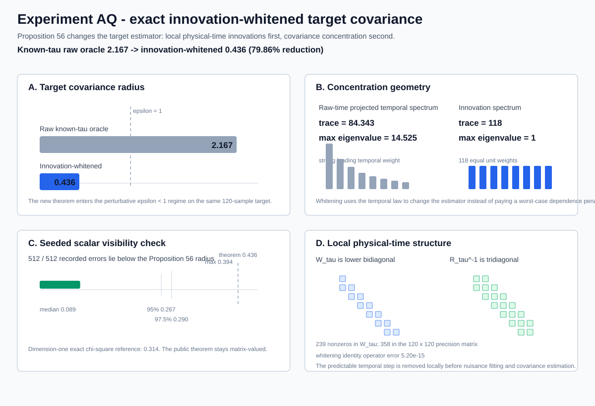

# Research index

This page is the audit-oriented navigation layer for the repository. It keeps physical interpretation, proved mathematics, reproducible numerical evidence, software verification, assumptions, literature sources, and any future consciousness interpretation separate.

A numerical experiment is not a proof. A theorem is not evidence that its assumptions hold in nature. An optimized world-tube is not proof of consciousness. A citation is not an endorsement by the cited author.

## Current research record

| Record | Current state |
| --- | ---: |
| Propositions | **56** |
| Reproducible experiments | **43, A-Z and AA-AQ** |
| Scientific result figures | **31** |
| Claim-level tests | **211** |
| Research-software version | **0.45.0** |
| CI matrix | **Python 3.10, 3.11, 3.12** |

The physics pipeline is an explanatory diagram and is not included in the scientific-result figure count.

## Where to start

| Reader goal | Best page |
| --- | --- |
| See the visual research history | [Repository front page](../README.md) |
| Trace the conceptual source and mathematical literature | [Bibliography and Citation Map](bibliography.md) |
| Understand the physical meaning of the equations | [Physics Guide](physics_guide.md) |
| Learn how to interpret theorem figures | [Figure Reading Guide](figure_reading_guide.md) |
| Follow the program as one coherent story | [Research Overview](research_overview.md) |
| Audit Propositions 1-43 | [Proof record](proofs_and_conjectures.md) |
| Audit Proposition 53A | [Physical relaxation and irregular-grid Markov structure](proposition_53_physical_relaxation_time.md) |
| Audit Proposition 53B | [Irregular-time finite-sample tau calibration](proposition_53b_irregular_tau_evalue.md) |
| Audit Proposition 54 | [Two-scale tau cover](proposition_54_two_scale_irregular_tau_cover.md) |
| Audit Proposition 55 | [Quadratic relaxation calibration](proposition_55_quadratic_relaxation_calibration.md) |
| Audit Proposition 56 | [Innovation-whitened target covariance](proposition_56_innovation_whitened_target.md) |
| Inspect the current release | [0.45.0 Research Record](release_0_45.md) |
| Inspect assumptions and failure conditions | [Assumption Ledger](assumption_ledger.md) |
| Inspect temporal-calibration APIs | [Temporal Calibration API](api_temporal_calibration.md) |
| Inspect rules for any future consciousness interpretation | [Interpretation Protocol](interpretation_protocol.md) |

---

# 1. Citation architecture

The project keeps three citation roles distinct.

1. **Primary conceptual source.** Max Tegmark's 2015 paper *Consciousness as a State of Matter* is the primary conceptual source and starting point for the research question.
2. **Direct mathematical or statistical source.** A theorem, inequality, distributional fact, or method that materially enters a proof or algorithm is cited as a direct source.
3. **Background lineage.** A paper can be important context without being the source of a proposition in this repository.

The complete attribution record is maintained in the [Bibliography and Citation Map](bibliography.md), with machine-readable references in [`references.bib`](../references.bib).

---

# 2. The theorem program

## Layer A. Foundations and first recovery theory, Propositions 1-14

Adjacent-state covariance, representation invariance inside declared blocks, transport, moving-path robustness, finite-sample recovery, covariance perturbation control, and identifiability limits.

Detailed statements and proofs: [Propositions 1-14](proofs_and_conjectures.md).

## Layer B. Structural compression and moving-partition theory, Propositions 15-31

Near-competitor structure, symbolic moving-clique recovery, overlap classes, covariance influence cones, interval-certified structural classes, residual bounds, and screened environmental recovery.

Detailed statements and proofs: [Propositions 15-31](proofs_and_conjectures.md).

## Layer C. Statistical screening and drift, Propositions 32-40

Safe sample splitting, Gaussian screening, structural-null refinements, covariance-normalized concentration, reusable pilot geometry, and population-drift calibration.

Detailed statements and proofs: [Propositions 32-40](proofs_and_conjectures.md).

## Layer D. Dependent measurements and temporal calibration, Propositions 41-52

| Proposition | Mathematical role | Physical role | Direct proof |
| ---: | --- | --- | --- |
| 41 | Dependent Gaussian covariance concentration | Corrects the information budget when samples have memory | [Proof record](proofs_and_conjectures.md) |
| 42 | Mean-centered temporal normalization | Accounts for removing an unknown baseline | [Proof record](proofs_and_conjectures.md) |
| 43 | Observable AR(1) calibration | Learns discrete persistence instead of assuming it | [Proof record](proofs_and_conjectures.md) |
| 44 | Fixed nuisance-subspace projection | Removes declared drift shapes before covariance estimation | [Proof](proposition_44_nuisance_projection.md) |
| 45 | Estimated dependence plus nuisance projection | Handles memory uncertainty and drift together | [Proof](proposition_45_estimated_ar1_nuisance_projection.md) |
| 46 | Design-specific temporal geometry | Uses actual removed-drift geometry rather than only rank | [Proof](proposition_46_design_specific_ar1_envelope.md) |
| 47 | Direct matrix concentration | Uses the complete projected temporal fluctuation spectrum | [Proof](proposition_47_weighted_wishart_matrix_chernoff.md) |
| 48 | Uniform matrix concentration over AR(1) uncertainty | Preserves covariance guarantees across uncertain persistence | [Proof](proposition_48_uniform_matrix_chernoff_ar1.md) |
| 49 | Compact temporal-family cover | Propagates a full admissible family of memory kernels | [Proof](proposition_49_compact_temporal_family.md) |
| 50 | Two-parameter temporal calibration | Learns persistence and fast uncorrelated variance | [Proof](proposition_50_calibrated_temporal_family.md) |
| 51 | Continuum e-value confidence set | Retains temporal models compatible with the complete calibration record | [Proof](proposition_51_evalue_temporal_confidence_set.md) |
| 52 | Certified outer cover plus target composition | Carries every still-compatible model into an independent target certificate | [Proof](proposition_52_certified_evalue_outer_cover.md) |

The measurement story is:

```text
record has memory and drift
        -> P41-P46: effective information and nuisance geometry
need a tight covariance guarantee
        -> P47-P49: direct matrix concentration over temporal families
temporal family is uncertain
        -> P50-P51: finite-sample calibration of compatible models
continuum uncertainty must enter an independent target theorem
        -> P52: certified outer cover and target composition
```

## Layer E. Sampling-consistent physical time, Proposition 53

Proposition 53 replaces a sample-index AR(1) coefficient by a physical relaxation time for the exponential model:

\[
R_\tau(i,j)=\exp\left(-\frac{|t_i-t_j|}{\tau}\right).
\]

For irregular adjacent gaps,

\[
\alpha_i=\exp\left(-\frac{t_{i+1}-t_i}{\tau}\right),
\]

with exact transition law

\[
X_{i+1}=\alpha_iX_i+\sqrt{1-\alpha_i^2}\,\varepsilon_i.
\]

The same theorem gives exact local innovation whitening and tridiagonal temporal precision.

- [Proposition 53A](proposition_53_physical_relaxation_time.md): sampling consistency and exact irregular-grid local structure.
- [Proposition 53B](proposition_53b_irregular_tau_evalue.md): finite-sample continuum e-value calibration of \(\tau\) on irregular timestamps.

## Layer F. Two-scale physical-time uncertainty propagation, Proposition 54

Proposition 54 separates the fine resolution used to certify calibration from the smaller target temporal cover used for independent covariance concentration.

[Proposition 54 proof](proposition_54_two_scale_irregular_tau_cover.md).

## Layer G. Local likelihood curvature, Proposition 55

Proposition 55 uses the exact observed-data likelihood slope plus a rigorous cell-local curvature bound to tighten the retained physical-time interval without spending additional probability budget.

Experiment AP reduces the 160-cell interval width by about 73%, but its known-\(\tau\) raw-time oracle still gives

\[
2.1672468952>1.
\]

That negative diagnostic identifies target covariance concentration, not calibration, as the next bottleneck.

[Proposition 55 proof](proposition_55_quadratic_relaxation_calibration.md).

## Layer H. Exact innovation-whitened target inference, Proposition 56

Proposition 56 uses the exact local temporal law operationally before target covariance concentration.

For

\[
Y=HB+E,
\qquad
\operatorname{vec}(E)\sim\mathcal N(0,R_\tau\otimes\Gamma),
\]

let \(W_\tau R_\tau W_\tau^\mathsf T=I\), define \(Z=W_\tau Y\) and \(G=W_\tau H\), and residualize with

\[
P_G=I-G(G^\mathsf TG)^{-1}G^\mathsf T.
\]

Then

\[
\widehat\Gamma_{\mathrm{IW}}
=
\frac{1}{N-q}Z^\mathsf TP_GZ
\]

satisfies

\[
\boxed{
(N-q)\widehat\Gamma_{\mathrm{IW}}
\sim\operatorname{Wishart}_d(\Gamma,N-q)
}.
\]

Thus Proposition 47 applies with exactly \(N-q\) unit temporal weights.

On Experiment AQ, \(N=120\), \(q=2\), and the certified scalar block radius is

\[
\boxed{0.4364443814<1},
\]

compared with the previous known-\(\tau\) raw-time oracle `2.1672468952`.

[Proposition 56 proof](proposition_56_innovation_whitened_target.md) | [Experiment AQ JSON](innovation_whitened_target.json) | [Experiment script](../examples/innovation_whitened_target.py) | [Figure](innovation_whitened_target.svg)

---

# 3. Recent experiment index

| ID | Proposition | Main question | Main result | Proof/data |
| --- | ---: | --- | --- | --- |
| AN | 53B | Can physical \(\tau\) be calibrated directly on irregular timestamps? | Valid continuum e-value set; first-order outer cover remains loose | [Proof](proposition_53b_irregular_tau_evalue.md) |
| AO | 54 | Can calibration resolution be separated from target cover resolution? | Target radius `3.15549 -> 2.57207` | [Proof](proposition_54_two_scale_irregular_tau_cover.md) |
| AP | 55 | Can local likelihood curvature tighten calibration? | 160-cell width contracts about 73%; target radius `2.41488`; known-\(\tau\) oracle `2.16725 > 1` | [Proof](proposition_55_quadratic_relaxation_calibration.md) |
| AQ | 56 | Can exact local innovations remove the target temporal penalty when \(\tau\) is known? | Raw oracle `2.16725 -> 0.43644`, a 79.86% reduction and `epsilon < 1` | [Proof](proposition_56_innovation_whitened_target.md) |

### Experiment AQ figure

[](proposition_56_innovation_whitened_target.md)

The four panels show the theorem-radius transition, raw temporal spectrum versus unit innovation weights, seeded scalar visibility checks, and the lower-bidiagonal/tridiagonal local structure used by the theorem.

---

# 4. Current frontier

The immediate frontier is no longer another calibration-only refinement.

The exact-target-\(\tau\) theorem now crosses `epsilon < 1`. The next problem is to determine how much of that information gain survives when \(\tau\) is only known through the finite-sample Proposition 55 confidence set.

The required object is the whitening mismatch

\[
W_{\widetilde\tau}R_\tau W_{\widetilde\tau}^\mathsf T-I,
\]

uniformly over certified true and working timescales, together with the transformed nuisance design \(W_{\widetilde\tau}H\).

A successful theorem would connect the finite-sample calibration side directly to the innovation-whitened target side without reverting to the earlier raw-time worst-case temporal penalty.

The broader physics questions remain sensor-coordinate invariance, spatial coarse graining, richer temporal kernels, model falsification, and intervention-sensitive identifiability.

Any future consciousness interpretation remains a separate bridge problem under the [Interpretation Protocol](interpretation_protocol.md).

---

# 5. Reproduction and audit rule

A result is considered complete when the relevant pieces exist together: physical question, declared measurement model, mathematical statement, assumptions, proof, implementation, claim-level tests, reproducible numerical record when useful, visible figure when useful, explicit failure conditions, discoverable links, and attribution to external mathematics or physical models materially used.

The documentation style check rejects Unicode en dash and em dash characters in Markdown files.
