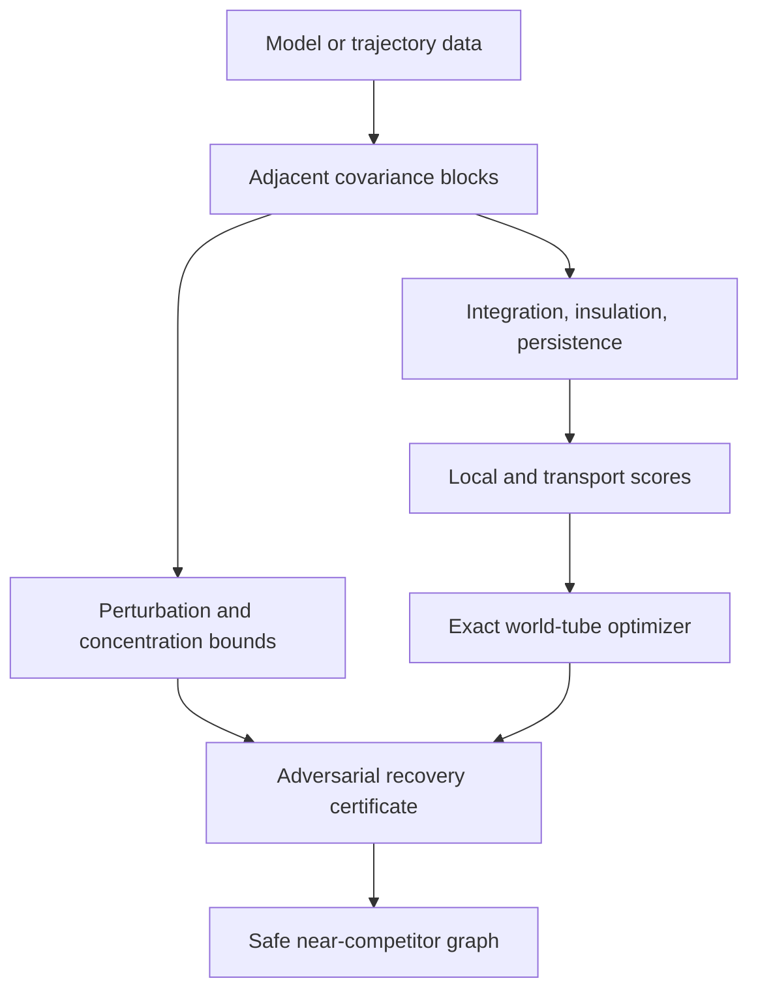

# Research overview

[](https://github.com/MahsaKeikha/spatiotemporal-observer-math/actions/workflows/test.yml)

This page is the shortest complete account of the project in its present form.
It gathers the mathematical question, the chain of proved results, the numerical
evidence, the code that produces it, and the limits of the interpretation in one
place. Detailed proofs and experimental records remain in their dedicated
documents; links below lead directly to those records.

## Follow this page

| If you want to understand | Go directly to |
| --- | --- |
| The scientific question | [The problem being studied](#the-problem-being-studied) |
| The equations used by the optimizer | [Score and path objective](#score-and-path-objective) |
| How the proof layers connect | [Evidence chain](#evidence-chain) |
| A particular proved statement | [Theorem index](#theorem-index) |
| A particular numerical study | [Experiment index](#experiment-index) |
| The figures and what each one shows | [Visual record of the results](#visual-record-of-the-results) |
| What is and is not established | [Strongest current conclusions](#strongest-current-conclusions) |
| Tests, code, and reproduction | [Reproducing and auditing the project](#reproducing-and-auditing-the-project) |
| Remaining limitations | [What remains unresolved](#what-remains-unresolved) |

## The problem being studied

Suppose the observed state is a time-indexed random vector
\(X_t\in\mathbb R^n\). Instead of fixing a subsystem in advance, let a candidate
boundary be a coordinate subset \(S_t\) that may change with time. A complete
candidate history is

\[
\mathcal W=(S_0,S_1,\ldots,S_{T-1}).
\]

The project asks when such a path can be identified from three observable forms
of organization: predictive interaction across the candidate's internal cut,
insulation from predictive drive outside the candidate, and persistence of its
predictive structure into the next state. The term *observer world-tube* is a
name for this mathematical object. It is not a claim that the selected subsystem
is conscious.

The implemented model is the nonstationary linear Gaussian process

\[
X_{t+1}=A_tX_t+\varepsilon_t,
\qquad \varepsilon_t\sim\mathcal N(0,Q_t),
\]

for which adjacent covariances, conditional mutual informations, and canonical
correlations can be evaluated exactly.

## Score and path objective

For candidate \(S\) at time \(t\), the local score is

\[
\Omega_t(S)=\bigl(G_t(S)K_t(S)P_t(S)\bigr)^{1/3}.
\]

Here \(G\) is weakest-cut directed integration, \(K\) is insulation from the
present environment, and \(P\) is canonical-correlation persistence. Each
factor lies in \([0,1]\). For an edge from \(S\) to \(R\),

\[
\Theta_t(S,R)=\bigl(K_t(S,R)P_t(S,R)\bigr)^{1/2}
\]

measures transported predictive organization. The complete finite-horizon
action is

\[
\mathcal A(\mathcal W)
=\sum_{t=0}^{T-1}\Omega_t(S_t)
+\chi\sum_{t=0}^{T-2}\Theta_t(S_t,S_{t+1})
-\lambda\sum_{t=0}^{T-2}d_J(S_t,S_{t+1}),
\]

where \(d_J\) is Jaccard distance. Dynamic programming returns the exact
maximizer and exact runner-up within the declared candidate family. The action
margin between them is the starting point for every recovery certificate.

## Evidence chain

The mathematical development is cumulative:

1. exact Gaussian covariance and information identities define the score;
2. exact path optimization supplies the winner and its margin;
3. covariance perturbation bounds control every score factor;
4. adversarial dynamic programs propagate local error budgets through the full
   path objective;
5. block and overlap-class recursions replace candidate enumeration by
   structural envelopes;
6. Gaussian concentration connects finite samples to covariance radii;
7. independent sample splitting separates data-dependent screening from final
   certification;
8. boundary-adaptive bounds improve the screen when a zero integration factor
   is known structurally rather than inferred from the same data;
9. covariance-normalized concentration removes the global eigenvalue-floor
   penalty while preserving the same end-to-end screen guarantee;
10. a reusable pilot covariance turns that geometry into observed,
    candidate-specific radii for later screening cohorts.

Each arrow in this chain carries explicit assumptions. The
[assumption ledger](assumption_ledger.md) records what fails if any one of them
is violated.



The upper route computes the selected path. The lower route answers a different
question: whether every admissible covariance perturbation leads to the same
path. Keeping those routes separate prevents a numerical optimum from being
mistaken for a robustness or confidence statement.

## Theorem index

All statements below are proved in
[Proved results and open problems](proofs_and_conjectures.md). They are
sufficient results under their stated assumptions; they are not presented as
necessary conditions.

| No. | Result | What it establishes |
| ---: | --- | --- |
| 1 | [Nonstationary adjacent covariance](proofs_and_conjectures.md#proposition-1-nonstationary-adjacent-covariance) | Exact covariance recursion and adjacent-state covariance for time-varying linear Gaussian dynamics. |
| 2 | [Representation invariance of canonical transport](proofs_and_conjectures.md#proposition-2-representation-invariance-of-canonical-transport) | Canonical transport is unchanged by invertible coordinate changes within source and target blocks. |
| 3 | [Bounded transport score](proofs_and_conjectures.md#proposition-3-bounded-transport-score) | The defined transport factors and score remain in the unit interval. |
| 4 | [Finite-horizon path robustness certificate](proofs_and_conjectures.md#proposition-4-finite-horizon-path-robustness-certificate) | A positive action margin yields a deterministic uniform score-error radius preserving the optimizer. |
| 5 | [Componentwise planted-path recovery](proofs_and_conjectures.md#proposition-5-componentwise-planted-path-recovery) | Local and incident-edge advantages imply unique global recovery of a declared planted path. |
| 6 | [Finite-sample recovery from uniform score bounds](proofs_and_conjectures.md#proposition-6-finite-sample-recovery-from-uniform-score-bounds) | A simultaneous score event and a deterministic margin combine into a recovery probability. |
| 7 | [Covariance perturbation bound for Gaussian CMI](proofs_and_conjectures.md#proposition-7-covariance-perturbation-bound-for-gaussian-cmi) | Spectral covariance error gives an explicit conditional-mutual-information error bound. |
| 8 | [Canonical-persistence perturbation bound](proofs_and_conjectures.md#proposition-8-canonical-persistence-perturbation-bound) | Covariance error controls canonical correlations and the persistence factor. |
| 9 | [End-to-end Gaussian sample-complexity guarantee](proofs_and_conjectures.md#proposition-9-end-to-end-gaussian-sample-complexity-guarantee) | Gaussian covariance concentration propagates to a complete path-recovery sample bound. |
| 10 | [Positive-factor stability of geometric scores](proofs_and_conjectures.md#proposition-10-positive-factor-stability-of-geometric-scores) | Away from zero factors, local and transport geometric means obey locally Lipschitz bounds. |
| 11 | [Localized finite-sample path certificate](proofs_and_conjectures.md#proposition-11-localized-finite-sample-path-certificate) | Candidate-specific blocks and an adversarial path calculation sharpen the global certificate. |
| 12 | [Parameter-level linear-Gaussian certificate](proofs_and_conjectures.md#proposition-12-parameter-level-linear-gaussian-certificate) | Transition and noise perturbations propagate directly to a finite-horizon recovery condition. |
| 13 | [Objective identifiability modulo symmetry](proofs_and_conjectures.md#proposition-13-objective-identifiability-modulo-symmetry) | Recovery is defined on equivalence classes when admissible symmetries preserve the objective. |
| 14 | [Two-model impossibility bound](proofs_and_conjectures.md#proposition-14-two-model-impossibility-bound) | Observationally identical models with incompatible labels impose a one-half maximin ceiling. |
| 15 | [Sufficient near-competitor graph](proofs_and_conjectures.md#proposition-15-sufficient-near-competitor-graph) | Forward-backward score envelopes safely discard states and edges that cannot challenge the winner. |
| 16 | [Symbolic recovery for covariance-preserving moving cliques](proofs_and_conjectures.md#proposition-16-symbolic-recovery-for-covariance-preserving-moving-cliques) | Closed-form factors and a recovery margin are obtained for a moving-clique family. |
| 17 | [Covariance propagation around the moving-clique family](proofs_and_conjectures.md#proposition-17-covariance-propagation-around-the-moving-clique-family) | Transition and noise perturbations produce explicit finite-horizon covariance radii. |
| 18 | [Quadratic CMI bound at zero conditional cross-covariance](proofs_and_conjectures.md#proposition-18-quadratic-cmi-bound-at-a-zero-conditional-cross-covariance) | Conditional mutual information grows quadratically with covariance error at an exact conditional-independence boundary. |
| 19 | [Robust recovery with external coupling and anisotropic noise](proofs_and_conjectures.md#proposition-19-robust-recovery-with-external-coupling-and-anisotropic-noise) | The moving-clique recovery result survives a declared nonzero perturbation neighborhood. |
| 20 | [Support-resolved finite-horizon recovery](proofs_and_conjectures.md#proposition-20-support-resolved-finite-horizon-recovery) | Candidate-local covariance blocks and exact incident-edge budgets sharpen the robust margin. |
| 21 | [A priori row-local recovery](proofs_and_conjectures.md#proposition-21-a-priori-row-local-recovery) | Row-restricted transition and forcing budgets give local recovery bounds without realized covariance propagation. |
| 22 | [Overlap-class recovery without candidate enumeration](proofs_and_conjectures.md#proposition-22-overlap-class-recovery-without-candidate-enumeration) | Candidate calculations compress to overlap classes with an exact feasible-edge rule. |
| 23 | [Structural budgets from block sparsity](proofs_and_conjectures.md#proposition-23-structural-budgets-from-block-sparsity) | Entry sizes and block degrees yield operator-norm budgets through a small comparison matrix. |
| 24 | [Block-local covariance influence cones](proofs_and_conjectures.md#proposition-24-block-local-covariance-influence-cones) | A fixed block graph preserves finite-speed support information in covariance-error propagation. |
| 25 | [Moving-partition covariance influence cones](proofs_and_conjectures.md#proposition-25-moving-partition-covariance-influence-cones) | Rectangular comparisons extend localized propagation to blocks that split, merge, or move. |
| 26 | [Moving-partition path-recovery certificate](proofs_and_conjectures.md#proposition-26-moving-partition-path-recovery-certificate) | Moving-partition covariance radii propagate through every score and the adversarial path objective. |
| 27 | [Class-compressed robust path recovery](proofs_and_conjectures.md#proposition-27-class-compressed-robust-path-recovery) | Exact factor symmetry permits robust recovery with class states rather than candidate lists. |
| 28 | [Interval-certified class recovery](proofs_and_conjectures.md#proposition-28-interval-certified-class-recovery) | Componentwise factor intervals replace exact within-class symmetry. |
| 29 | [Covariance-residual derivation of class intervals](proofs_and_conjectures.md#proposition-29-covariance-residual-derivation-of-class-intervals) | Representative covariances and spectral residuals generate valid factor intervals. |
| 30 | [Block-structural residual class recovery](proofs_and_conjectures.md#proposition-30-block-structural-residual-class-recovery) | Moving block envelopes generate the covariance residuals required by class recovery. |
| 31 | [Screened-environment structural recovery](proofs_and_conjectures.md#proposition-31-screened-environment-structural-recovery) | Source-specific present compression is valid when omitted conditional information is explicitly charged. |
| 32 | [Independent sample-split confidence composition](proofs_and_conjectures.md#proposition-32-independent-sample-split-confidence-composition) | A safe first split and independent certification split combine with product confidence. |
| 33 | [Gaussian first-split screening safety](proofs_and_conjectures.md#proposition-33-gaussian-first-split-screening-safety) | Fixed Gaussian candidate blocks give a complete concentration-to-screen guarantee. |
| 34 | [Positive-factor refinement of Gaussian screening](proofs_and_conjectures.md#proposition-34-positive-factor-refinement-of-gaussian-screening) | Empirical factors with positive lower endpoints receive sharper local Lipschitz radii. |
| 35 | [Structural-null screening at the score boundary](proofs_and_conjectures.md#proposition-35-structural-null-screening-at-the-score-boundary) | A predeclared exact integration null receives a quadratic boundary bound and a safe, tighter state radius. |
| 36 | [Trajectory-coupled Gaussian screening safety](proofs_and_conjectures.md#proposition-36-trajectory-coupled-gaussian-screening-safety) | Marginal Wishart bounds and simultaneous screening remain valid when all times come from the same independent trajectories. |
| 37 | [Covariance-normalized Gaussian screening](proofs_and_conjectures.md#proposition-37-covariance-normalized-gaussian-screening) | A population-whitened Wishart event controls CMI, canonical persistence, structural nulls, and the complete screen without a covariance condition-number factor. |
| 38 | [Pilot-normalized adaptive screening](proofs_and_conjectures.md#proposition-38-pilot-normalized-adaptive-screening) | An observed pilot-to-screening discrepancy composes with pilot uncertainty to give candidate-specific relative radii and a safe adaptive graph. |
| 39 | [Drift-robust pilot-normalized screening](proofs_and_conjectures.md#proposition-39-drift-robust-pilot-normalized-screening) | A declared population-relative drift envelope transports the adaptive certificate into the current population metric, with an explicit validity boundary. |
| 40 | [Statistically calibrated population drift](proofs_and_conjectures.md#proposition-40-statistically-calibrated-population-drift-envelope) | Two simultaneous covariance events turn old and current calibration cohorts into a candidate-specific drift envelope with an explicit joint confidence. |

## Experiment index

Exact commands, parameters, tables, and qualifications are in
[Reproducible results](reproducible_results.md).

| ID | Calculation | Principal recorded outcome |
| --- | --- | --- |
| A | [Fixed modular structure](reproducible_results.md#experiment-a-fixed-modular-structure) | Planted blocks rank first; a correlated-noise control has positive static dependence but zero directed observer score. |
| B | [Changing-boundary world-tube](reproducible_results.md#experiment-b-changing-boundary-world-tube) | All 5 planted boundaries are recovered; action margin `0.126421`, certified uniform radius `0.010535`. |
| C | [Finite-sample recovery](reproducible_results.md#experiment-c-finite-sample-recovery) | Exact recovery rises from `0.313` at 80 trajectories to `1.000` at 640; an easy local baseline remains competitive. |
| D | [Exchangeable non-identifiability](reproducible_results.md#experiment-d-exchangeable-non-identifiability) | Permutation-related paths tie, the labeled margin is zero, and the two-model maximin ceiling is `0.500`. |
| E | [Symbolic moving-clique recovery](reproducible_results.md#experiment-e-symbolic-moving-clique-recovery) | Symbolic margin lower bound `0.130806`; exact margin `0.175335`; 3 of 3 boundaries recovered. |
| F | [Robust symbolic recovery](reproducible_results.md#experiment-f-robust-symbolic-recovery) | Nonzero cross-boundary and anisotropic-noise perturbations retain an exact margin of `0.175280`; several increasingly local certificates are compared. |
| G | [Block-sparse structural recovery](reproducible_results.md#experiment-g-block-sparse-structural-recovery) | Six overlap classes represent `8,250,291,250,200` candidates and retain a positive margin `0.045031`. |
| H | [Localized influence cone](reproducible_results.md#experiment-h-localized-influence-cone) | A remote covariance perturbation leaves the observed block radius exactly zero until graph distance seven. |
| I | [Moving-partition influence cone](reproducible_results.md#experiment-i-moving-partition-influence-cone) | The zero persists through changing block counts `4 -> 3 -> 4 -> 2 -> 3` until the declared layered route arrives. |
| J | [Moving-partition recovery](reproducible_results.md#experiment-j-moving-partition-recovery-certificate) | Local moving-partition errors feed the full adversarial path certificate and retain positive robust slack. |
| K | [Class-compressed robust recovery](reproducible_results.md#experiment-k-class-compressed-robust-recovery) | Six classes replace a candidate family with more than eight trillion members per layer. |
| L | [Heterogeneous interval-class recovery](reproducible_results.md#experiment-l-heterogeneous-interval-class-recovery) | Nonzero within-class factor widths retain robust slack `0.449062`. |
| M | [Covariance-residual-derived intervals](reproducible_results.md#experiment-m-covariance-residual-derived-class-intervals) | Representative models plus residuals produce the intervals and robust slack `0.530115`. |
| N | [Block-structured residual recovery](reproducible_results.md#experiment-n-block-structured-residual-class-recovery) | Primitive block envelopes produce residuals and robust slack `0.801508`. |
| O | [Screened-environment recovery](reproducible_results.md#experiment-o-screened-environment-structural-recovery) | Screened covariance radius `2.500e-08` versus `6.250e-05` for the full environment; slack `0.799524`. |
| P | [Independent sample-split accounting](reproducible_results.md#experiment-p-independent-sample-split-confidence-accounting) | 25 retained versus 10,000 unscreened blocks; minimum certification counts `80,182` and `107,350`; combined confidence `0.950625`. |
| Q | [Gaussian-safe first-split screening](reproducible_results.md#experiment-q-gaussian-safe-first-split-screening) | At \(10^{12}\) observations, a 60-state/576-edge graph reduces to 5 states and 4 edges under the zero-safe theorem. |
| R | [Positive-factor refinement](reproducible_results.md#experiment-r-positive-factor-screening-refinement) | At \(10^7\) observations, the refined graph has 4 states and 3 edges while the zero-safe graph remains at 16 and 48. |
| S | [Exact-Wishart screen calibration](reproducible_results.md#experiment-s-gaussian-screening-calibration) | All 64 trials cover each declared event at five scales; the 64-of-64 Wilson interval is only `[0.943376, 1]`, and graph reduction remains conservative. |
| T | [Structural-null boundary screen](reproducible_results.md#experiment-t-structural-null-boundary-screening) | At \(8\times10^{10}\) observations, the corrected 28-state null mask reduces the safe graph from 40 states/231 edges to 15 states/27 edges while retaining the population path. |
| U | [Trajectory-coupled Gaussian screening calibration](reproducible_results.md#experiment-u-trajectory-coupled-gaussian-screening-calibration) | One full 42-dimensional Wishart draw preserves cross-time dependence; all declared events are covered in 128 trials at each of five scales. |
| V | [Multi-regime trajectory-coupled calibration](reproducible_results.md#experiment-v-multi-regime-trajectory-coupled-calibration) | Across 18 declared memory, coupling, and conditioning regimes, all four screening events are covered in 1,152 trials; selectivity varies from 5.1% to 87.5% of edges retained. |
| W | [Covariance-normalized screening](reproducible_results.md#experiment-w-covariance-normalized-screening) | On 1,152 paired draws, the relative certificate covers every recorded event and retains exactly the five-state/four-edge population tube in all 18 regimes. |
| X | [Reusable-pilot adaptive screening](reproducible_results.md#experiment-x-reusable-pilot-adaptive-screening) | A reusable high-precision pilot cuts the maximum relative radius to about 51% of the fixed radius and reduces the safe graph in every tested regime. |
| Y | [Screening under declared population drift](reproducible_results.md#experiment-y-screening-under-declared-population-drift) | A structure-preserving drift curve retains all declared events but exposes rapid loss of graph selectivity as the envelope grows. |
| Z | [Estimating drift versus refreshing the reference](reproducible_results.md#experiment-z-estimating-drift-versus-refreshing-the-reference) | A 640-pair comparison validates the confidence-budgeted drift envelope and finds that refreshing the current reference is more selective on this construction. |

These are controlled synthetic calculations. Large combinatorial counts show
that the compressed certificate does not enumerate candidates; they do not by
themselves establish empirical realism. Likewise, very large nominal sample
counts expose conservatism in the available inequalities rather than propose a
practical data-collection plan.

## Visual record of the results

Every figure below is generated by a committed experiment. Select a figure to
open the exact command, model parameters, numerical table, and interpretation
for that result.

### Moving-boundary inference

[](reproducible_results.md#experiment-b-changing-boundary-world-tube)

The heat map shows local candidate scores over time; the outline is the path
selected by the complete objective. It is important that these are not the same
quantity: transport and continuity can change the global choice.

[](reproducible_results.md#experiment-b-changing-boundary-world-tube)

The phase diagram records where all five planted boundaries are recovered and
where an excessive membership-continuity penalty forces failure. It therefore
shows both the successful regime and a controlled failure regime.

### Finite-sample behavior

[](reproducible_results.md#experiment-c-finite-sample-recovery)

Recovery improves as independent trajectory ensembles grow. The figure retains
the negative comparison that independent local selection performs better at
intermediate sample sizes on this easy family.

### Closed-form and robust recovery regions

[](reproducible_results.md#experiment-e-symbolic-moving-clique-recovery)

The black contour is the zero symbolic-margin boundary. The warm certified
region satisfies the sufficient theorem; points outside it are uncertified and
are not automatically failures.

[](reproducible_results.md#experiment-f-robust-symbolic-recovery)

This region adds bounded cross-boundary transition coupling and anisotropic
noise. The marked construction is checked by both the exact optimizer and the
finite-horizon perturbation certificate.

### Statistical screening

[](reproducible_results.md#experiment-z-estimating-drift-versus-refreshing-the-reference)

Experiment Z uses two 98.75% simultaneous covariance events to produce a 97.5%
union-bound drift guarantee. All 640 paired trials satisfy the declared drift,
covariance, score, validity, and path events. The current-reference control is
substantially more selective than transporting the old reference at every
displayed calibration size.

[Complete comparison table](reproducible_results.md#experiment-z-estimating-drift-versus-refreshing-the-reference) ·
[machine-readable results](calibrated_drift_comparison.json) ·
[theorem](proofs_and_conjectures.md#proposition-40-statistically-calibrated-population-drift-envelope)

[](reproducible_results.md#experiment-y-screening-under-declared-population-drift)

Experiment Y changes the population covariance by an invertible coordinatewise
congruence while preserving the information factors and optimal path. The
drift-robust theorem covers all 448 recorded covariance, score, and path events.
The graph nevertheless becomes complete at larger envelopes, giving a visible
boundary between a valid certificate and a useful screen.

[Complete drift table](reproducible_results.md#experiment-y-screening-under-declared-population-drift) ·
[machine-readable results](drift_robust_relative_calibration.json) ·
[theorem](proofs_and_conjectures.md#proposition-39-drift-robust-pilot-normalized-screening)

[](reproducible_results.md#experiment-x-reusable-pilot-adaptive-screening)

The adaptive comparison uses one high-precision pilot per regime and 64 later
screening draws. Candidate-specific observed discrepancies reduce the maximum
relative radius to about half the fixed simultaneous radius. The complete
covariance, score, and path events are retained in all recorded draws.

[Complete adaptive table](reproducible_results.md#experiment-x-reusable-pilot-adaptive-screening) ·
[machine-readable results](cross_fitted_relative_calibration.json) ·
[theorem](proofs_and_conjectures.md#proposition-38-pilot-normalized-adaptive-screening)

[](reproducible_results.md#experiment-w-covariance-normalized-screening)

The paired heat maps hold the data, model, sample budget, and structural-null
mask fixed. The left panels show the condition-sensitive absolute certificate;
the right panels show the Proposition 37 relative certificate. In this grid the
relative calculation retains only the population path in every trial.

[Complete paired table](reproducible_results.md#experiment-w-covariance-normalized-screening) ·
[machine-readable results](relative_covariance_calibration.json) ·
[proof and assumptions](proofs_and_conjectures.md#proposition-37-covariance-normalized-gaussian-screening)

[](reproducible_results.md#experiment-v-multi-regime-trajectory-coupled-calibration)

The regime map puts population separation and finite-sample screen usefulness
side by side. Stronger internal coupling generally improves both, while
anisotropic noise can enlarge the action margin yet weaken screening by lowering
the candidate-local spectral floor. This separation is the principal result of
Experiment V.

[Complete table](reproducible_results.md#experiment-v-multi-regime-trajectory-coupled-calibration) ·
[machine-readable results](multi_regime_coupled_calibration.json) ·
[construction and limitations](experimental_protocol.md#multi-regime-trajectory-coupled-calibration)

[](reproducible_results.md#experiment-s-gaussian-screening-calibration)

Coverage and usefulness are deliberately shown together. All recorded events
are covered in this limited run, while the retained graph remains complete at
several sample scales, exposing the conservatism of the analytical radius.

[](reproducible_results.md#experiment-u-trajectory-coupled-gaussian-screening-calibration)

The coupled calibration draws one covariance for the complete trajectory and
then extracts all adjacent blocks. Its third panel compares measured cross-time
sample-variance error correlations with their exact Gaussian values, making the
dependence visible rather than treating it as a verbal qualification.

[](reproducible_results.md#experiment-t-structural-null-boundary-screening)

The boundary figure compares the generic and boundary-adaptive radii on the same
Wishart draw. With the corrected mask of 28 exact nulls, the structural-null
screen retains 37.5% of states and 10.5% of edges while preserving the
population path. This conclusion is conditional on every masked null being
exact.

## Strongest current conclusions

| Question | Current answer | Status |
| --- | --- | --- |
| Can the declared finite path objective be optimized exactly? | Yes, including its exact runner-up and margin. | Exact algorithmic result |
| Can bounded score perturbations be converted into path recovery? | Yes, globally, locally, and through class-compressed adversarial path bounds. | Deterministic theorem |
| Can covariance error be propagated through CMI and canonical correlation? | Yes, under either absolute spectral or covariance-normalized relative events, with explicit constants. | Deterministic theorem |
| Can a complete finite-sample confidence statement be made? | Yes for independent Gaussian trajectories. Proposition 37 avoids declared spectral envelopes by using a relative Wishart event. | Statistical theorem; conservative |
| Can data-dependent screening be certified? | Yes with an independently sampled certification stage. | Statistical theorem |
| Can covariance radii adapt to an observed reference discrepancy? | Yes. A Gaussian pilot event composes with each exact pilot-normalized screening discrepancy. | Proposition 38 |
| Can that certificate survive population covariance drift? | Yes, conditional on an independently valid candidate-block drift envelope. The correction is sharp in one dimension and can become nonselective well before it becomes invalid. | Proposition 39; Experiment Y |
| Can the drift envelope receive a finite-sample confidence statement? | Yes for fixed Gaussian candidate blocks using old and current calibration cohorts. On the tested construction, refreshing the reference is more selective than transporting the old one. | Proposition 40; Experiment Z |
| Can exact structural zeros improve the difficult score-boundary rate? | Yes. The local-score error improves from the generic \(N^{-1/6}\) boundary rate to \(N^{-1/3}\) under a correct predeclared null. | Proposition 35 |
| Does the score identify a unique boundary in every model? | No. Exchangeable models give a proved non-identifiability counterexample. | Impossibility theorem |
| Does a high score prove consciousness? | No. That interpretation is neither defined nor supported by these results. | Explicit scope boundary |

## The new structural-null result

The Gaussian calibration revealed a specific obstruction: most incorrect
candidates in that construction have an exactly zero population integration
factor. A generic cube-root perturbation bound treats this boundary with a
Hölder inequality and contracts only as \(N^{-1/6}\).

When the zero is a structural property fixed before seeing the screening data,
Proposition 18 gives a quadratic conditional-information perturbation bound.
Proposition 35 propagates it through the local score. This changes the boundary
rate to \(N^{-1/3}\) and permits a materially smaller safe graph in Experiment
T. The mask is an assumption, not an estimated label: declaring a genuinely
positive-integration state to be null can understate its error and invalidate
the guarantee. A regression test contains that false-null counterexample.

## Reproducing and auditing the project

### Current verification record

| Check | Recorded result | Follow the evidence |
| --- | --- | --- |
| Automated tests | 116 of 116 pass | [Claim-level test index](experimental_protocol.md#9-tests-tied-to-scientific-claims), [`tests`](../tests) |
| Static analysis | Ruff reports no violations | [Continuous-integration workflow](../.github/workflows/test.yml) |
| Supported CI runtimes | Python 3.10, 3.11, and 3.12 | [Project configuration](../pyproject.toml) |
| Reproducible experiments | 26 documented studies, A through Z | [Commands and exact outputs](reproducible_results.md) |
| Committed result figures | 13 script-generated PNG figures | [Figure-generation protocol](experimental_protocol.md#8-what-the-figures-show) |

The test count is a software verification record, not a measure of scientific
truth. The tests check identities, bound containment, optimizer invariants,
input rejection, seeded reproducibility, and stated counterexamples. They do
not replace validation on independently designed models or empirical data.

Set up the environment from the repository root:

```bash
python -m venv .venv
source .venv/bin/activate
python -m pip install -e ".[dev,viz]"
python -m pytest
python -m ruff check .
```

Then run the newest calculation:

```bash
python examples/calibrated_drift_comparison.py --trials 64 --jobs 6
```

The audit trail is organized as follows:

| Need | Location |
| --- | --- |
| Definitions and objective | [Mathematical framework](mathematical_framework.md) |
| Complete derivations | [Derivations](derivations.md) |
| Theorem statements and proofs | [Proved results and open problems](proofs_and_conjectures.md) |
| Assumptions and failure consequences | [Assumption ledger](assumption_ledger.md) |
| Experimental construction rules | [Experimental protocol](experimental_protocol.md) |
| Exact outputs and commands | [Reproducible results](reproducible_results.md) |
| Public Python interface | [API guide](api.md) |
| Core implementation | [`src/observer_math`](../src/observer_math) |
| Claim-level regression tests | [`tests`](../tests) |
| Executable studies | [`examples`](../examples) |
| Machine-readable calibration data | [`gaussian_screen_calibration.json`](gaussian_screen_calibration.json), [`trajectory_coupled_screen_calibration.json`](trajectory_coupled_screen_calibration.json), [`multi_regime_coupled_calibration.json`](multi_regime_coupled_calibration.json), [`relative_covariance_calibration.json`](relative_covariance_calibration.json), [`cross_fitted_relative_calibration.json`](cross_fitted_relative_calibration.json), [`drift_robust_relative_calibration.json`](drift_robust_relative_calibration.json), [`calibrated_drift_comparison.json`](calibrated_drift_comparison.json) |

## What remains unresolved

The principal limitations are substantive, not presentational:

- the strongest statistical results assume independent Gaussian trajectories;
- the relative certificate avoids spectral-envelope inputs, but its whitening is
  a proof device and its Gaussian assumption remains restrictive;
- statistical drift calibration is proved only for fixed Gaussian blocks;
  estimating it from dependent windows remains unresolved;
- the available finite-sample constants remain far from empirical recovery
  scales on the initial benchmark;
- a structural-null mask must be justified independently of the screening data;
- the benchmark family is synthetic and does not yet test latent common drive,
  missing variables, nonlinear dynamics, or variable-size boundaries;
- comparative work against external methods has not yet been completed; and
- the quantum factorization geometry remains a research program rather than an
  implemented theorem.

The next statistical step is a drift-robust or dependent-window analogue of the
pilot-normalized event, followed by non-Gaussian concentration. The next modeling step is a preregistered
benchmark in which temporal transport is necessary rather than merely available.
These targets, including completion criteria, are maintained in the
[research program](research_program.md).

## Interpretation

This repository establishes a rigorous framework for a moving-boundary
identification problem and tests it on transparent synthetic systems. It does
not establish phenomenal consciousness, sentience, agency, moral status, or a
privileged decomposition of nature. Its useful contribution is narrower: the
definitions, assumptions, sufficient conditions, counterexamples, algorithms,
and numerical checks are explicit enough to be inspected and challenged.
