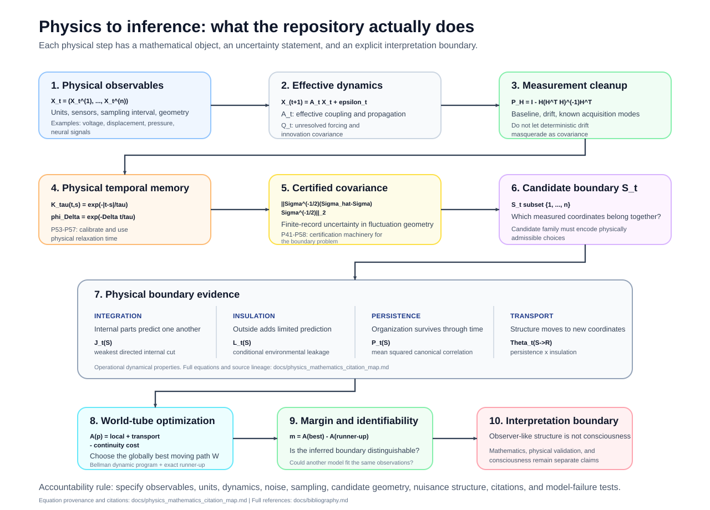
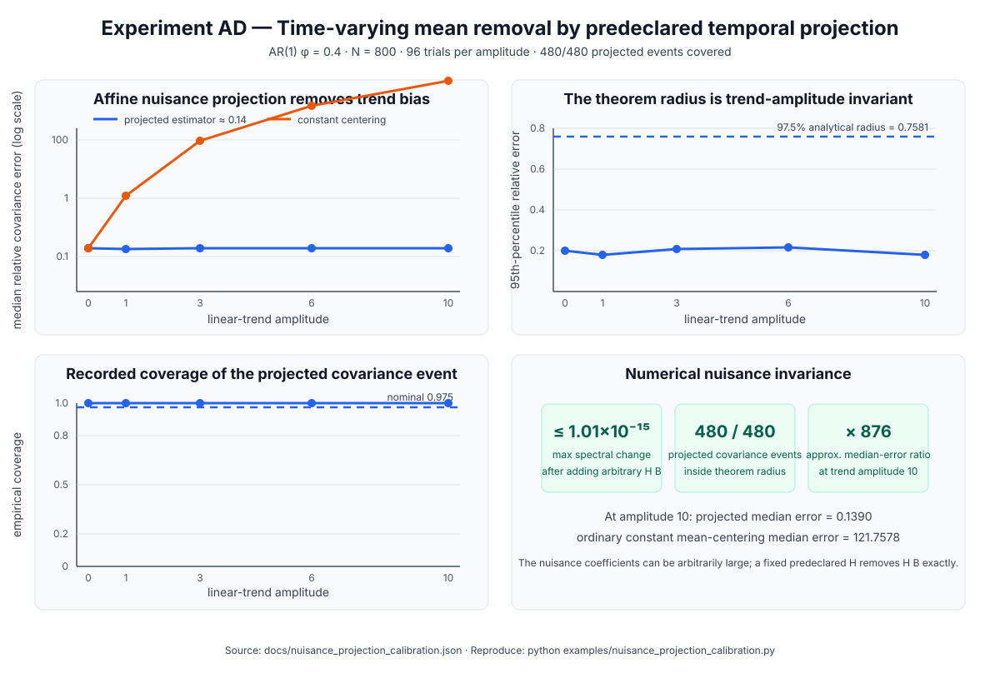
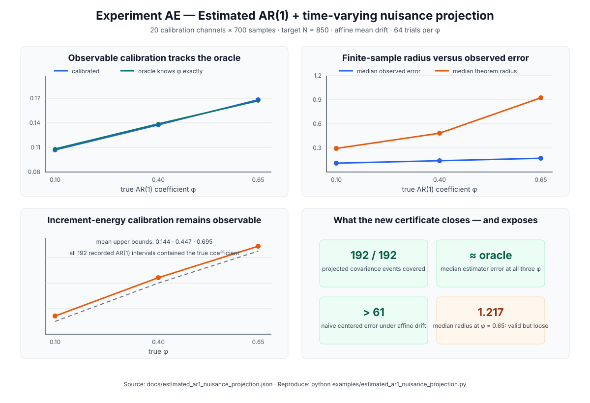
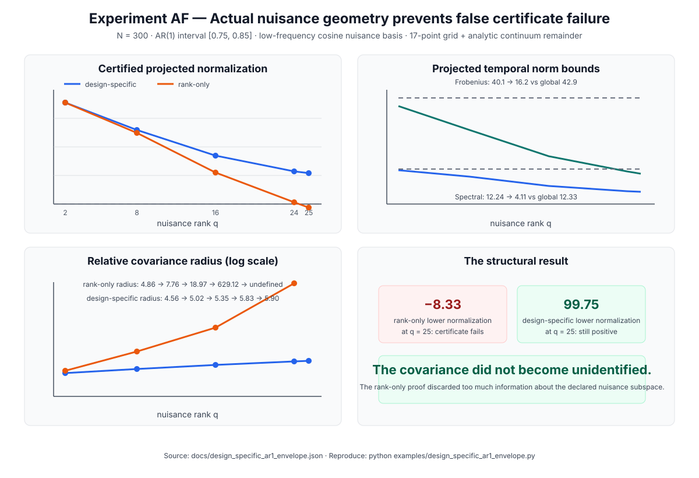
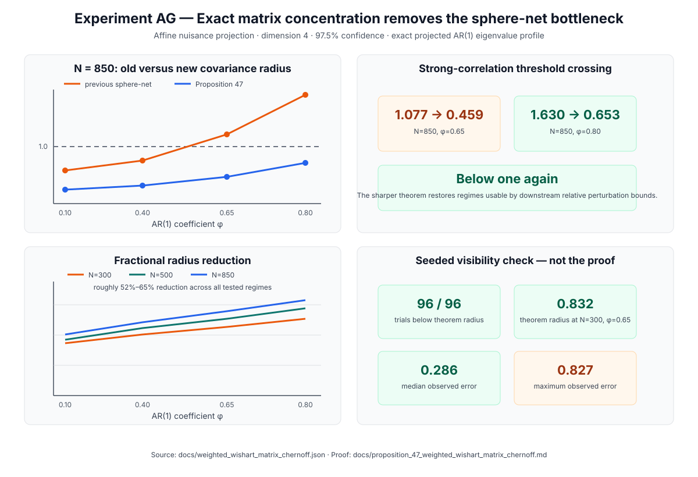
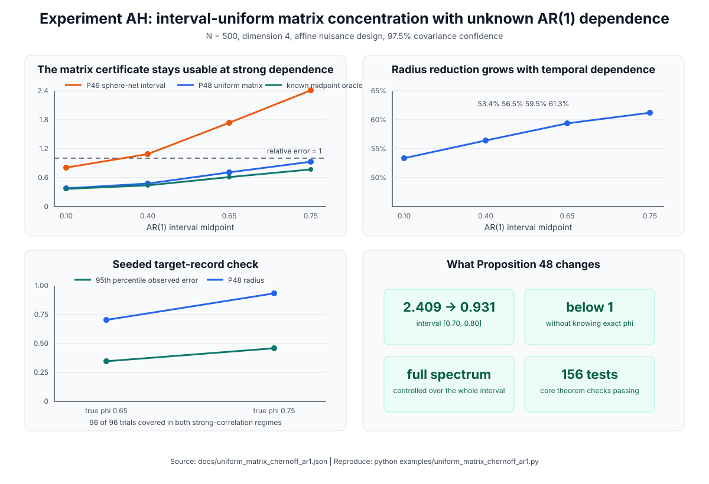
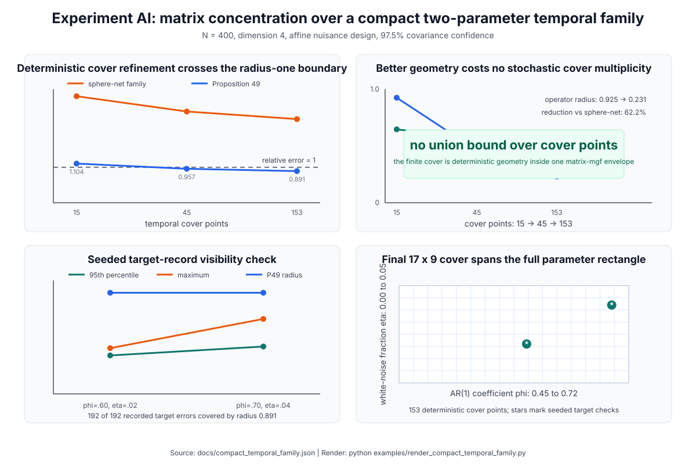
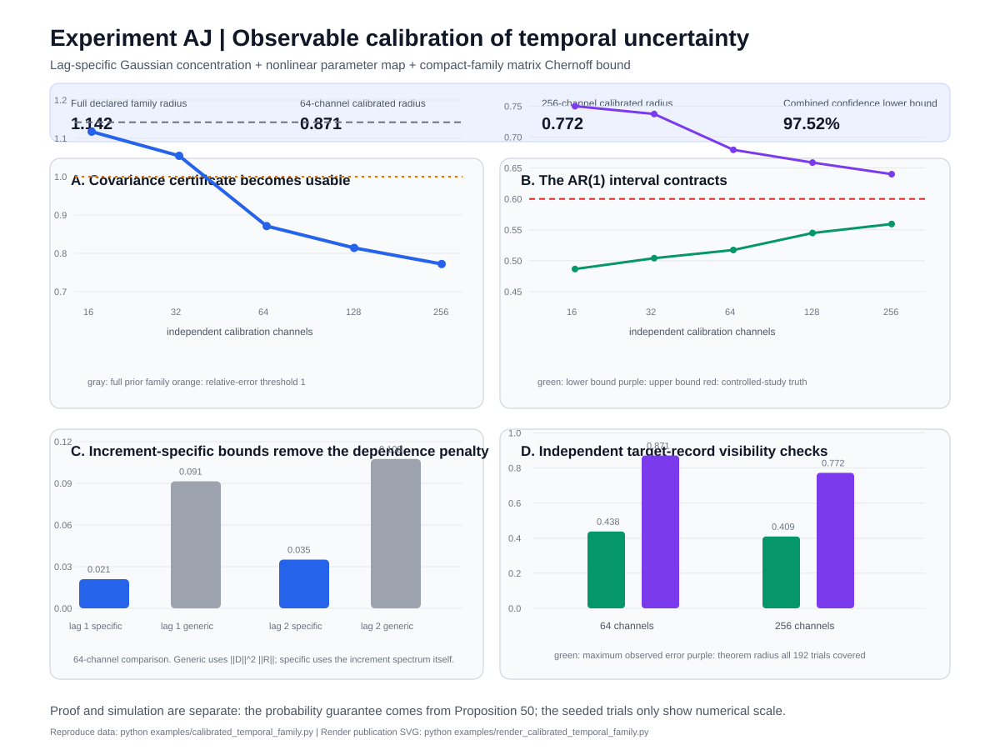
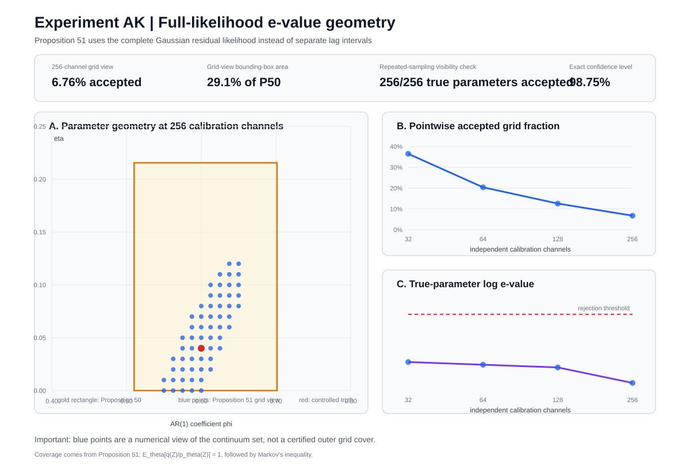

# Research overview

This page explains the project as a research story rather than as a file list. If the equations feel abstract, read the [Physics Guide](physics_guide.md) first. For the complete theorem and experiment map, use the [research index](research_index.md).

The current 0.39.0 research record contains 51 propositions, 37 reproducible experiments, 24 committed scientific figures, and 171 claim-level tests.

## The question

Most dynamical analyses begin by deciding which variables belong to the system and which belong to its environment. This project asks whether that order can sometimes be reversed.

At time `t`, let a candidate subsystem be a coordinate set `S_t`. A changing candidate history is

\[
\mathcal W=(S_0,S_1,\ldots,S_{T-1}),
\]

which the repository calls an **observer world-tube**.

The central question is:

> **When can a moving subsystem path be distinguished from alternatives using internal predictive organization, environmental insulation, persistence, and continuity through time?**

The word "observer" is operational. It is not a claim about consciousness or subjective experience.

## The physics picture

The mathematics begins with measured physical degrees of freedom. A coordinate might represent a voltage, displacement, pressure signal, neural measurement, chemical concentration, position, or another experimentally defined observable.

The full measured state is

\[
X_t=(X_t^{(1)},\ldots,X_t^{(n)}).
\]

A candidate subsystem `S_t` is therefore not an abstract label floating above the data. It is a proposed set of measured physical degrees of freedom.

A useful mental model is a coherent structure moving across a sensor field. A vortex crossing a fluid array, a localized mechanical mode moving through a lattice, or a coordinated activity pattern moving across recording channels may be represented by different sensors at different times while still preserving dynamical continuity.

The world-tube is the time history of that changing measured boundary.

The recent temporal-statistics theorems are easier to understand in this picture. Their job is not to define the observer. Their job is to certify that the covariance and information quantities used to score candidate boundaries are not artifacts of temporal memory, baseline drift, nuisance trends, or finite record length.

## The population model

The main exact theory uses a nonstationary linear Gaussian process

\[
X_{t+1}=A_tX_t+\varepsilon_t,
\qquad
\varepsilon_t\sim\mathcal N(0,Q_t).
\]

Physical reading:

- `X_t` is the vector of measured observables;
- `A_t` is an effective coupling or propagation operator over one sampling interval;
- `epsilon_t` represents unresolved stochastic forcing inside the model;
- `Q_t` is the covariance of that unresolved forcing.

The model is an effective stochastic description, not automatically a fundamental law. In an experiment, the application must justify the observables, units, sampling interval, preprocessing, coordinate basis, and the timescale over which the linear approximation is intended to hold.

Gaussianity is likewise a modeling assumption. It is used because covariance propagation, conditional mutual information, canonical correlation, and finite-sample concentration become analytically tractable.

## What the four score components mean physically

### Internal integration

A candidate should contain components that participate in a common predictive organization. Its internal pieces should not behave like an arbitrary collection of unrelated sensors.

### Environmental insulation

Once the candidate's own state is known, outside coordinates should add comparatively limited predictive information about its immediate evolution.

This does not mean thermodynamic isolation. A physical open system can exchange energy, matter, and information with its surroundings while still having enough internal predictive closure to define a useful boundary.

### Persistence

The candidate should carry predictive structure into its future. A one-frame fluctuation is not enough.

### Transport

If the physical structure moves, information should be carried into the new coordinates representing it. Identity therefore does not require permanent membership of the same sensors.

## Why covariance is the statistical backbone

For a fluctuating system,

\[
\Sigma=\mathbb E[(X-\mu)(X-\mu)^\top]
\]

describes the geometry of fluctuations.

The diagonal entries are coordinate variances. Off-diagonal entries measure co-fluctuation. Eigenvectors describe collective fluctuation directions and eigenvalues describe variance along those directions.

These covariance modes are not automatically physical energy modes. An energy interpretation requires an additional physical derivation.

In the Gaussian model, the candidate-boundary information quantities are functions of covariance blocks. Therefore uncertainty in covariance must be propagated into uncertainty in boundary scores and path selection.

Many recent results control

\[
\left\|
\Sigma^{-1/2}(\widehat\Sigma-\Sigma)\Sigma^{-1/2}
\right\|_2
\le\epsilon.
\]

When `epsilon < 1`, the empirical covariance remains inside a useful perturbation regime. Positive fluctuation directions remain positive, inverse covariance calculations can be controlled, and downstream Gaussian information quantities can be bounded.

The threshold `1` is mathematical, not a physical phase transition.

## Why temporal memory changes the inference problem

Repeated measurements from a physical system are usually correlated in time. A persistent process does not provide one independent sample at every acquisition step.

The recent AR(1) model is

\[
R_\phi(i,j)=\phi^{|i-j|}.
\]

The parameter `phi` controls persistence. With sampling interval `Delta t`, a useful relaxation-time interpretation is

\[
\tau=-\frac{\Delta t}{\log\phi},
\]

when AR(1) is physically adequate.

The newer two-parameter family is

\[
R_{\phi,\eta}=(1-\eta)R_\phi+\eta I.
\]

Here `phi` controls the persistence timescale of the correlated component and `eta` controls a temporally uncorrelated variance fraction inside the chosen model family.

Real physical systems may require several relaxation times, oscillatory kernels, colored noise, nonstationary spectra, or continuous spectral densities. The current temporal family is a controlled starting point, not a universal law.

## Why nuisance projection is physically necessary

A measured record can contain deterministic structure that should not be confused with stochastic dynamics.

The recent theory writes a declared nuisance mean as

\[
HB.
\]

Columns of `H` can represent a constant baseline, linear drift, known thermal trend, acquisition artifact, or another predeclared temporal shape. The projector

\[
P_H=I-H(H^\top H)^{-1}H^\top
\]

removes those modes exactly.

Physical reading: remove known deterministic measurement structure before estimating the fluctuation covariance.

The nuisance design must be fixed in advance unless a separate adaptive-selection argument is supplied. Otherwise the projection can overfit the stochastic record itself.

## Identifiability comes first

Optimization does not create identifiability.

Propositions 13 and 14 formalize recovery only up to admissible symmetries and construct an observational equivalence case where incompatible labels cannot both be recovered from the stated observations with uniformly high success probability.

This sets a standing rule:

> **Recovery is always relative to declared observables, physical model assumptions, candidate families, and admissible symmetries.**

That rule applies to every result in the repository and becomes even more important for any future consciousness interpretation.

---

# How the proof program developed

## Population mathematics

Propositions 1 through 8 establish covariance identities, information quantities, transport properties, path robustness logic, and covariance perturbation bounds.

## Finite-sample recovery

Proposition 9 gives the first complete Gaussian sample-complexity theorem. Later results localize covariance blocks, exploit positive factor floors, derive candidate-specific budgets, and propagate those budgets through path optimization.

## Structural compression

Propositions 15 through 31 use near-competitor graphs, overlap classes, block sparsity, covariance influence cones, moving partitions, factor intervals, and screened environmental structure.

## Statistically safe screening and drift

Propositions 32 through 40 add sample splitting, Gaussian screening guarantees, structural-null refinements, trajectory coupling, covariance-normalized concentration, reusable pilot geometry, and population-drift calibration.

## Temporally dependent observations

Propositions 41 through 51 address temporal dependence, nuisance means, temporal-parameter uncertainty, direct matrix concentration, compact covariance families, and finite-sample temporal calibration.

---

# The recent sequence, translated into physics

## Proposition 41: temporal dependence changes effective sample size

Physical problem: a record with memory contains less independent information than its raw number of time samples suggests.

The covariance radius begins to depend on temporal Frobenius and spectral norms rather than treating record length as an independent sample count.

## Proposition 42: removing the mean changes normalization

Physical problem: subtracting an unknown baseline changes the fluctuation quadratic form and therefore changes the usable normalization.

## Proposition 43: estimate a shared AR(1) coefficient

Physical problem: the persistence timescale should be estimated from observable data rather than treated as known.

Increment energy produces an observable confidence interval for a shared nonnegative AR(1) coefficient, and that uncertainty is propagated into covariance calibration.

## Proposition 44: allow a time-varying nuisance mean

Physical problem: large baseline or drift modes can produce false covariance if they are not separated from fluctuations.

A fixed declared temporal design `H` is projected away exactly. Experiment AD shows that the projected estimator remains stable while ordinary mean-centering fails under large affine drift.

## Proposition 45: combine temporal calibration with nuisance projection

Physical problem: temporal memory is uncertain at the same time that deterministic drift must be removed.

Observable AR(1) calibration and time-varying nuisance removal are combined in one finite-sample covariance bound.

## Proposition 46: use the actual nuisance geometry

Physical problem: two nuisance designs with the same rank can remove very different temporal modes.

The theorem uses the actual declared nuisance geometry instead of only its rank.

## Proposition 47: use direct matrix concentration

Physical problem: covariance uncertainty should be controlled using the complete fluctuation-mode spectrum rather than a loose directional approximation.

The sphere-net operator-norm reduction is replaced by an exact Gaussian matrix exponential moment and a matrix-Laplace bound.

## Proposition 48: make the matrix bound uniform over unknown AR(1)

Physical problem: the covariance certificate should remain valid even when the relaxation parameter is only known to lie in an interval.

The complete projected temporal eigenvalue profile is controlled between AR(1) grid points.

## Proposition 49: separate temporal-family geometry from probability

Physical problem: one real system may admit several physically plausible temporal-memory models.

Proposition 49 replaces the one-dimensional AR(1) continuum by a compact temporal covariance family represented by a certified deterministic finite cover.

## Proposition 50: learn a two-parameter temporal family from data

For

\[
R_{\phi,\eta}=(1-\eta)R_\phi+\eta I,
\]

lag-1 and lag-2 increment energies yield finite-sample intervals for the lag correlations.

Physical problem: independently calibrate both persistence and the fast uncorrelated variance fraction before analyzing the target record.

## Proposition 51: build a joint continuum confidence set from the full likelihood

A fixed Helmert contrast removes arbitrary constant calibration-channel means. Let \(p_\theta\) be the residual Gaussian density and \(q\) a proper mixture density fixed before the data are observed. Define

\[
e_\theta(Z)=\frac{q(Z)}{p_\theta(Z)}.
\]

At the true parameter,

\[
\mathbb E_\theta e_\theta(Z)=1.
\]

Therefore

\[
\mathcal C_\alpha(Z)=\{\theta:e_\theta(Z)<1/\alpha\}
\]

contains the true parameter with probability at least \(1-\alpha\).

Physical reading: the calibration record defines a finite-sample set of temporal-memory models that remain compatible with the observed residual dynamics under the declared family.

The e-value is not a posterior probability that a temporal parameter is true.

Experiment AK evaluates the exact pointwise function on a visualization grid. At 256 calibration channels, the displayed accepted points occupy about 6.76 percent of the declared grid and span a visibly tighter joint region than the Proposition 50 rectangle in the controlled example.

The plotted grid is not a certified outer cover of the continuum confidence set.

## Proposition 52: current development target

The current branch is developing a certified adaptive outer cover of the Proposition 51 continuum set and composing that cover with Proposition 49 for an independent target covariance record.

Physical problem: carry calibrated uncertainty about temporal memory all the way into the covariance used to score a target system without pretending that a plotting grid is exact.

The proof must separately certify projected fluctuation-mode geometry and covariance normalization. This distinction is part of the current Proposition 52 audit.

---

# What the project has established

Under the stated assumptions, the repository provides a conditional mathematical pipeline from measured stochastic dynamics to moving-boundary optimization and finite-sample recovery certification.

Its most developed statistical layer can handle:

- temporally dependent Gaussian sampling;
- unknown constant or fixed-subspace nuisance means;
- estimated nonnegative AR(1) dependence;
- actual nuisance-design geometry;
- direct matrix concentration using the full temporal spectrum;
- compact multi-parameter temporal covariance families;
- independently calibrated two-parameter temporal uncertainty;
- a finite-sample joint continuum confidence set based on the complete residual likelihood.

## What a physical application still has to prove experimentally

The mathematical theorem is only the first layer. A physical application must also establish that the chosen measurement model is adequate.

At minimum, document:

- what each coordinate measures and its units;
- sampling interval and sensor bandwidth;
- physical meaning of the coordinate basis;
- effective mechanism represented by `A_t`;
- unresolved processes represented by `Q_t`;
- nuisance modes removed by `H`;
- why the candidate family represents physically admissible boundaries;
- whether AR(1) or the chosen temporal family fits held-out residual structure;
- whether the inferred boundary survives unit changes, coordinate changes, sampling changes, and reasonable model perturbations;
- what intervention or competing model could falsify the physical interpretation.

The [Physics Guide](physics_guide.md) contains the complete accountability checklist.

## What remains open

The newest results still rely on explicit model assumptions, including Gaussian calibration, temporal-family correctness, and declared nuisance structure.

The immediate statistical target is:

> **Construct a certified adaptive outer cover of the Proposition 51 e-value confidence set, then compose that random cover with Proposition 49 for an independent target record.**

A parallel statistical direction is to extend the same finite-sample calibration principle beyond the AR(1) plus white-noise family toward richer covariance and spectral-density models.

The structural frontier runs in parallel:

> **Develop intervention-sensitive and representation-invariant observer quantities, together with impossibility theorems that state exactly what passive observations cannot identify.**

Any later consciousness interpretation must remain a separate bridge hypothesis under the [interpretation protocol](interpretation_protocol.md). It is not a hidden consequence of the observer notation.

## Why negative results matter

The project treats impossibility results, failed parameter regimes, conservative bounds, and counterexamples as part of the research record. A theorem that says what cannot be identified can be more informative than a broad positive claim because it tells us which additional observables or assumptions are mathematically necessary.
